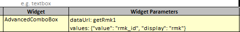
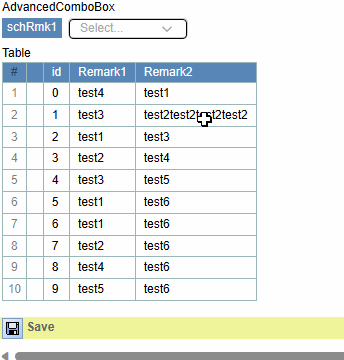

## Function

Set the widget of a line to AdvancedComboBox in simpleFg or searchFg. And set
the widget parameters of this line to with 2 parameters: dataUrl, values.
Example:

"data/dataUrl" is necessary, The combo box needs to get all the options
selected by the dropdown box by this method.

"values" is not necessary, the default value is "{value: 'value', display:
'display'}". Each option of the drop-down box has a display value and an
actual value, and this parameter is used to specify which property is the
actual value and which property is the display value of each option in the
obtained data.

### Example

## Implementation method

### AdvancedComboBox.tsx

    
    
    interface IAdvancedComboBox {
      ref: any
      advancedComboBoxLabel: string
      value?: any
      require: boolean
      name: string
      editable: boolean
      style?: any
      tip?: string
      widgetParameter?: any
    }
    const AdvancedComboBox: React.FC<IAdvancedComboBox> = forwardRef((props, ref: Ref<any>) => {
      const HttpPost = useHttp(pyiLocalStorage.globalParams.HTTP_TYPE_POST)
    
      const [selectValues, setSelectValues] = useState([])
      const [valueAndDisplay, setValueAndDisplay] = useState([])
      const [tooltip, setTooltip] = React.useState("String")
    
      useImperativeHandle(ref, () => ({
        getSelected: () => {
          return selectValues.map((option) => option["value"]).join(",")
        },
      }))
    
      useEffect(() => {
        console.log(props.value, valueAndDisplay);
        
        if (props.value) {
          const selectedValues = props.value.split(",")
          const selectedOptions = valueAndDisplay.filter(option => selectedValues.includes(String(option.value)));
          setSelectValues(selectedOptions)
        } else {
          setSelectValues([])
        }
    
        // set tooltip
        if (props.tip) {
          if (props.tip.includes("\\r\\n")) {
            setTooltip(props.tip.replace(/\\r\\n/g, "\r\n"))
          } else if (props.tip.includes("\\n")) {
            setTooltip(props.tip.replace(/\\n/g, "\r\n"))
          } else if (props.tip.includes("\\r")) {
            setTooltip(props.tip.replace(/\\r/g, "\r\n"))
          } else {
            setTooltip(props.tip)
          }
        }
      }, [props.value, props.tip])
    
      const data = props.widgetParameter.data
      useEffect(() => {
        let values = props.widgetParameter.values
        const dataUrl = props.widgetParameter.dataUrl
        if (values) {
          values = JSON.parse(values)
        } else {
          values = { value: "value", display: "display" }
        }
        if (data) {
          if (typeof data === "string") {
            setValueAndDisplay(JSON.parse(data))
          } else if (Array.isArray(data)) {
            if (typeof data[0] !== "object") {
              let options = []
              data.forEach((option) => {
                options.push({ value: String(option), label: String(option) })
              })
              setValueAndDisplay(options)
            } else {
              if ("value" in data[0] && "display" in data[0]) {
                let options = []
                data.map((item: any, index) => options.push({ value: item["value"], label: item["display"] }))
                setValueAndDisplay(options)
              } else {
                let options = []
                data.forEach((option) => {
                  options.push({ value: option[values.value], label: option[values.display] })
                })
                setValueAndDisplay(options)
              }
            }
          }
        } else if (dataUrl) {
          HttpPost(dataUrl, JSON.stringify({ useDataUrl: true }))
            .then((response) => response.json())
            .then((result) => {
              if (result.data) {
                let options = []
                result.data.forEach((option) => {
                  options.push({ value: option[values.value], label: option[values.display] })
                })
                setValueAndDisplay(options)
              }
            })
        }
      }, [props.widgetParameter, data])
    
      let cellStyle = []
      if (props.style) {
        const properties = Object.keys(props.style)
        properties.forEach((property) => {
          cellStyle.push([property, props.style[property]])
        })
      }
    
      const IAdvancedComboBoxNode = React.useMemo(
        () => (
          <>
            <th className="property_key">{props.advancedComboBoxLabel}</th>
            <td>
              <MultiSelect
                options={valueAndDisplay}
                value={selectValues}
                onChange={setSelectValues}
                hasSelectAll={false}
                className="advanced_select"
                labelledBy="Select"
              />
            </td>
            <td>{tooltip ? {tooltip} : null}</td>
          </>
        ),
        [props.advancedComboBoxLabel, valueAndDisplay, selectValues, tooltip]
      )
    
      useEffect(() => {
        function adjustSvgSize(selector) {
          const svgElement = document.querySelector(selector)
          if (svgElement) {
            svgElement.setAttribute("viewBox", "0 0 24 24")
            svgElement.setAttribute("width", "18")
            svgElement.setAttribute("height", "18")
          }
        }
    
        const selectors = [".dropdown-search-clear-icon", ".dropdown-heading-dropdown-arrow"]
        selectors.forEach((selector) => adjustSvgSize(selector))
      }, [IAdvancedComboBoxNode])
    
      return <>{IAdvancedComboBoxNode}</>
    })
    export default AdvancedComboBox
    

