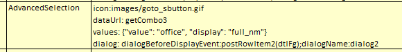

## Function

Set the widget of a line to AdvancedSelection in simpleFg. And set the widget
parameters of this line to with 2 parameters: icon, dataUrl, values, dialog.
Example:

"icon" is necessary, it determines what icons are used for the buttons in the
component.

"data/dataUrl" is necessary, The AdvancedSelection needs to get all the
options selected by the dropdown box by this method.

"values" is not necessary, the default value is "{value: 'value', display:
'display'}". Each option of the drop-down box has a display value and an
actual value, and this parameter is used to specify which property is the
actual value and which property is the display value of each option in the
obtained data.

"dialog" is necessary, setting the parameters of open dialog.

### Example

## Implementation method

### AdvancedSelection.tsx

    
    
    interface IAdvancedSelection {
      ref: any
      labelLabel: string
      labelValue: any
      name: string
      editable: boolean
      clickPrams: any
      tip?: string
      widgetParameter?: any
    }
    const AdvancedSelection: React.FC<IAdvancedSelection> = forwardRef((props, ref: Ref<any>) => {
      const { screenID, closeDialog, openDialog, createEventData } = useContext(DialogContext)
    
      const HttpPost = useHttp(pyiLocalStorage.globalParams.HTTP_TYPE_POST)
    
      const [selectValue, setSelectValue] = React.useState<string>("")
      const [valueAndDisplay, setValueAndDisplay] = React.useState([])
      const [tooltip, setTooltip] = React.useState(String)
    
      React.useEffect(() => {
        setSelectValue(props.labelValue)
        // set tooltip
        if (props.tip) {
          if (props.tip.includes("\\r\\n")) {
            setTooltip(props.tip.replace(/\\r\\n/g, "\r\n"))
          } else if (props.tip.includes("\\n")) {
            setTooltip(props.tip.replace(/\\n/g, "\r\n"))
          } else if (props.tip.includes("\\r")) {
            setTooltip(props.tip.replace(/\\r/g, "\r\n"))
          } else {
            setTooltip(props.tip)
          }
        }
      }, [props, props.labelValue, props.tip])
    
      React.useEffect(() => {
        const data = props.widgetParameter.data
        let values = props.widgetParameter.values
        const dataUrl = props.widgetParameter.dataUrl
        if (values) {
          values = values.replace(/'/g, '"')
          values = JSON.parse(values)
        } else {
          values = { value: "value", display: "display" }
        }
        if (data) {
          if (typeof data === "string") {
            setValueAndDisplay(JSON.parse(data))
          } else if (Array.isArray(data)) {
            if (typeof data[0] !== "object") {
              let options = []
              data.forEach((option) => {
                options.push({ value: String(option), display: String(option) })
              })
              setValueAndDisplay(options)
            } else {
              if ("value" in data[0] && "display" in data[0]) {
                setValueAndDisplay(data)
              } else {
                let options = []
                data.forEach((option) => {
                  options.push({ value: option[values.value], display: option[values.display] })
                })
                setValueAndDisplay(options)
              }
            }
          }
        } else if (dataUrl) {
          HttpPost(dataUrl, JSON.stringify({ useDataUrl: true }))
            .then((response) => response.json())
            .then((result) => {
              if (result.data) {
                let options = []
                result.data.forEach((option) => {
                  options.push({ value: option[values.value], display: option[values.display] })
                })
                setValueAndDisplay(options)
              }
            })
        }
      }, [props.widgetParameter])
    
      const buttonClick = async () => {
        Loading.show()
        try {
          const btnType = "normal"
          const dialogParams = getDialogParams(props.widgetParameter.dialog)
          const dialogName = dialogParams["dialogName"]
          const title = dialogParams["dialogTitle"]
          const message = dialogParams["dialogMessage"]
          const eventWithParams = dialogParams["dialogBeforeDisplayEvent"]
          const continueNm = dialogParams["continueNm"] ? dialogParams["continueNm"] : "Continue"
          const cancelNm = dialogParams["cancelNm"] ? dialogParams["cancelNm"] : "Cancel"
    
          let eventName
          let eventParams
          let beforeDisplayData = {}
          if (eventWithParams) {
            eventName = getDialogEvent(eventWithParams)
            eventParams = getDialogEventParamArr(eventWithParams)
            beforeDisplayData = createEventData(eventParams)
          }
          let buttonData = createEventData(props.clickPrams[1].fieldGroups)
    
          if (eventName) {
            const dialogEventHandler = getDialogEventHandler(eventName, screenID)
            await HttpPost(dialogEventHandler, JSON.stringify(beforeDisplayData))
              .then((response) => response.json())
              .then((result) => {
                if (validateResponse(result, false)) {
                  const dialogTitle = result.data && result.data["title"] ? result.data["title"] : ""
                  const dialogMessage = result.data && result.data["dialogMessage"] ? result.data["dialogMessage"] : ""
                  const params = {
                    dialogTitle: dialogTitle,
                    dialogMessage: dialogMessage,
                    dialogType: btnType,
                    screenID: screenID,
                    dialogName: dialogName,
                    onCancel: () => closeDialog(),
                    onContinue: (dialogData) => onClickEvent(btnType, {...buttonData, ...dialogData}),
                    continueNm: continueNm,
                    cancelNm: cancelNm,
                  }
                  openDialog(params)
                }
              })
          } else {
            const params = {
              dialogTitle: title,
              dialogMessage: message,
              dialogType: btnType,
              screenID: screenID,
              dialogName: dialogName,
              onCancel: () => closeDialog(),
              onContinue: (dialogData) => onClickEvent(btnType, {...buttonData, ...dialogData}),
              continueNm: continueNm,
              cancelNm: cancelNm,
            }
            openDialog(params)
          }
        } catch (error) {
          pyiLogger.error(error) // YL, 2023-02-09 bugfix
          Loading.remove()
        } finally {
          Loading.remove()
        }
      }
    
      const onClickEvent = async (btnType, buttonData) => {
        let removeLoadingDiv = true
        Loading.show()
        try {
          const eventHandler = props.clickPrams[0]
          if (btnType && btnType.toLocaleLowerCase() === pyiGlobal.TABLE_NORMAL_BTN_TYPE) {
            await HttpPost(eventHandler, JSON.stringify(buttonData))
              .then((response) => response.json())
              .then((result) => {
                if (validateResponse(result, false)) {
                  const newValue = result.data["value"]
                  setSelectValue(newValue)
                }
              })
          }
        } catch (error) {
          pyiLogger.error(error)
          removeLoadingDiv = true
        } finally {
          if (removeLoadingDiv) {
            Loading.remove()
          }
        }
      }
    
      return (
        <>
          <th className="property_key">{props.labelLabel}</th>
          <td className="property_value tip_center">
            <input ref={ref} type="hidden" name={props.name} id={props.name} value={selectValue}></input>
            {valueAndDisplay &&
              valueAndDisplay.length > 0 &&
              valueAndDisplay.map((item: any) => (item["value"] === selectValue ? item["display"] : null))}
            {tooltip ? {tooltip} : null}
            &nbsp;&nbsp;
            <ImageButton
              key={1}
              caption={""}
              name={props.name}
              widgetParameter={props.widgetParameter}
              clickEvent={() => buttonClick()}
              editable={props.editable}
            />
          </td>
        </>
      )
    })
    
    export default AdvancedSelection
    

