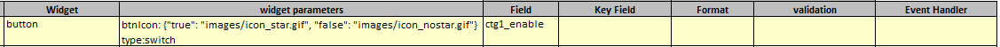
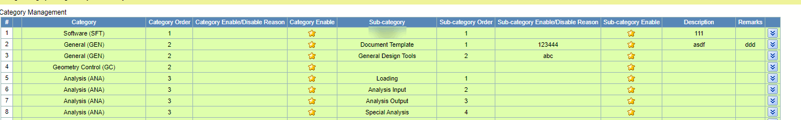
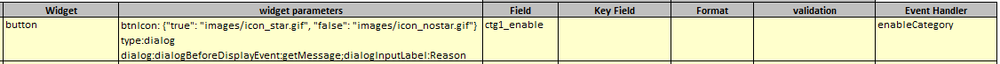
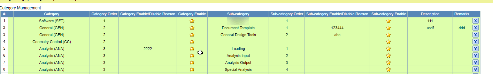

## Function

Add a button in the cell of table, set different click events according to
different settings.

### Type 1: switch

Click on the button to toggle the actual value corresponding to the button.

This is the setting of the button box in the excel sheet when type is switch:

"btnIcon:{"value1": "icon1", "value2": "icon2"}" means display "icon1" when
the actual value is "value1", display "icon1" when the actual value is
"value1".

Tip: When type is "switch", button click only in the front end of the modified
table data, additional usage of the Save button is needed to save the table
changes.

Here is an example:

### Type 2: dialog

Click the button to display a dialog box, enter the reason for the change in
the dialog box, and click the "Continue" button in the dialog box to save the
changes.

This is the setting of the button box in the excel sheet when type is switch:

"btnIcon:{"value1": "icon1", "value2": "icon2"}" means display "icon1" when
the actual value is "value1", display "icon1" when the actual value is
"value1".

"dialog:dialogBeforeDisplayEvent:getMessage;" means use function "getMessage"
in backend get the dialog title and dialog message.

"dialog:dialogInputLabel:Reason" means the label of the input box is "Reason".

"Event Handler: enableCategory" means click the button to trigger the function
"enableCategory" in backend.

Tip: When type is "dialog", The button click event will directly trigger the
function "enableCategory" in back-end to modify the form data, without the
need for an additional save button.

Here is an example:

## Implementation method

### Change in DataViewer.tsx

Add a new format in DataViewer.tsx: button, when the format is button is
called component ButtonCell.tsx.

"value" is the actual value of this cell;

"active" is the coordinates of this cell;

"buttonBoxPrams" save all parameters of this button cell;

"index" is the index of this button box column on all buntton boc columns;

"initialData" is the initial data of the table. When the type is "switch",
this data is needed to determine if the line status needs to be modified.

    
    
    ...
    else if (buttonCols.indexOf(column) !== -1) {
      const index = buttonCols.indexOf(column)
      return (
        <ButtonCell
          value={value}
          active={{ row: row, column: column }}
          buttonBoxPrams={buttonBoxPrams}
          index={index}
          initialData={initialData}
        ></ButtonCell>
      )
    }
    ...
    

### Add component ButtonCell.tsx

Functions "changeOption" and "showDialog" are the button click events when the
format is "switch" and "dialog" respectively.

buttonBoxPrams contains four parameters：btnIcon, type, eventHandler, dialog.

    
    
    const pyiGlobal = pyiLocalStorage.globalParams
    
    interface IButton {
      value: any
      buttonBoxPrams: any
      index: number
      active: Point.Point
      initialData: any[]
    }
    
    const Button: React.FC<IButton> = (props) => {
      const inputRef = React.useRef<any>(null)
    
      const value = props.value
      const index = props.index
      const btnIcon = props.buttonBoxPrams.btnIcon[index]
      const type = props.buttonBoxPrams.type[index]
      const eventHandler = props.buttonBoxPrams.eventHandler[index]
      const dialog = props.buttonBoxPrams.dialog[index]
    
      const dispatch = useDispatch()
      const setCellData = React.useCallback(
        (
          active: Point.Point,
          data: Types.CellBase,
          initialData?: any[],
          isCheckbox?: boolean
        ) => dispatch(Actions.setCellData(active, data, initialData, isCheckbox)),
        [dispatch]
      )
      const refreshTable = React.useCallback(
        (refreshFlag: boolean) => dispatch(Actions.refreshTable(refreshFlag)),
        [dispatch]
      )
    
      const onCancel = () => {
        // clearMessage()
        // pyiLocalStorage.clearSysMsgs()
        ReactDOM.unmountComponentAtNode(document.getElementById("iconAndText"))
      }
      const onContinue = async (eventHandler, dialogData) => {
        Loading.show()
        // pyiLocalStorage.clearSysMsgs()
        try {
          dialogData["reason"] = inputRef.current?.value
          ReactDOM.unmountComponentAtNode(document.getElementById("iconAndText"))
          await HttpPost(eventHandler, JSON.stringify(dialogData))
            .then((response) => response.json())
            .then((result) => {
              if (validateResponse(result, false)) {
                refreshTable(true)
              }
            })
        } catch (error) {
          Loading.remove()
          console.log("Load screen error: " + error)
        } finally {
          Loading.remove() // can't delete
        }
      }
    
      const showDialog = React.useCallback(() => {
        const dialogParams = getDialogParams(dialog)
          
        const eventName = dialogParams["dialogBeforeDisplayEvent"]
        const inputLabel = dialogParams["dialogInputLabel"]
        const dialogEventHandler = getDialogEventHandler(eventName, eventHandler)
        const id = Matrix.get({ row: props.active.row, column: 0 },props.initialData)["value"]
        const dialogData = { id: id, index: index }
    
        if (eventName && dialogEventHandler) {
          HttpPost(dialogEventHandler, JSON.stringify(dialogData))
            .then((response) => response.json())
            .then((result) => {
              if (validateResponse(result, false)) {
                const dialogTitle =
                  result.data && result.data["title"] ? result.data["title"] : ""
                const dialogMessage =
                  result.data && result.data["dialogMessage"] ? result.data["dialogMessage"] : ""
                const params = {
                  dialogTitle: dialogTitle,
                  dialogMessage: dialogMessage,
                  onCancel: onCancel,
                  onContinue: () => onContinue(eventHandler, dialogData),
                  inputRef: inputRef,
                  inputLabel: inputLabel
                }
                IconAndText(params)
              }
            })
        }
      }, [])
    
      const changeOption = React.useCallback(() => {    
        if (String(value)?.trim().toLocaleLowerCase() === "true") {
          setCellData(props.active, { value: "false" }, props.initialData)
        } else if (String(value)?.trim().toLocaleLowerCase() === "false") {
          setCellData(props.active, { value: "true" }, props.initialData)
        }
      }, [value])
    
      if (type && type.toLocaleLowerCase() === "dialog" && btnIcon) {
        return (
          
        )
      } else if (type && type.toLocaleLowerCase() === "switch" && btnIcon){
        return (
            
          )
      } else {
        return null
      }
    }
    
    export default Button
    

