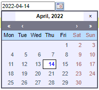
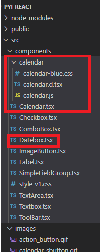

## Interface

## Calendar component

### calendar.d.ts

declare for the function/component define in js files.

    
    
    export declare function setup(props:SetupProps): JSX.Element;
    export interface SetupProps {
        inputField?:string;
        displayArea?:string;
        button?:string;
    	eventName?:string;
    	ifFormat?:string;
    	daFormat?:string;
    	singleClick?:boolean|true;
    	disableFunc?:string;
    	dateStatusFunc?:string;	// takes precedence if both are defined
    	mondayFirst?:boolean;
    	align?:string;
    	range?:[];
    	weekNumbers?:boolean;
    	flat?:boolean;
    	flatCallback?:string
    	onSelect?:boolean;
    	onClose?:boolean;
    	onUpdate?:boolean;
    	date?:string;
    	showsTime?:boolean;
    	timeFormat?:string;
        displayStatusBars?:boolean
    }
    

### Calendar.tsx

    
    
    import React, { ChangeEvent, forwardRef, Ref, useEffect, useState } from "react"
    import * as calendar from "./calendar/calendar"
    import "./calendar/calendar-blue.css";
    // import img_cal1 from "../images/calendar_sbutton.gif";
    
    export type Props = {
        calType:calendarTypes;
        cid?:string;
        textStr?:string;
        hideInputAndCal?:boolean;
        ref:any
    }
    
    
    // flat:display a calendar on the window directly, slect a date won't call any function.
    // input: input filed+button,click button to show calendar, and then select a date to show on input field
    // displayare: select a date, then the date content show in display area
    // button:click the button to show a calendar.
    type calendarTypes="flat"|"input"|"displayArea"|"button"
    
    var calendarGID:number=0;
    
    let imgUrl1 ="./images/calendar_sbutton.gif";
    const reqSvgs1 = require.context("../", true, /\.(gif|png|jpg)$/)
    // reqSvgs1(imgUrl1)
    const img_cal = reqSvgs1(imgUrl1)
    
    
    
    export const Calendar: React.FC<Props>=forwardRef((props, ref: Ref<any>) =>{
    
        const{calType,cid,textStr}=props;
    
        const hideInputAndCal=props.hideInputAndCal?props.hideInputAndCal:false
    
        const[spanClass,setSpanClass]=useState(hideInputAndCal?"span_h":"span_s")
    
        const [dtValue, setDtValue] =useState<string>(textStr?textStr:"")
        
    
        const loadInFlat=(flatId:string)=>{
    
            {calendar.setup({flat:flatId,flatCallback:"", ifFormat:"%Y-%m-%d",timeFormat:"24",showsTime:false,weekNumbers:false,displayStatusBars:false})}
      
         }
    
         const loadInDisplayArea=(displayAreaId:string)=>{
    
            {calendar.setup({displayArea:displayAreaId,ifFormat:"%Y-%m-%d",timeFormat:"24",showsTime:false,weekNumbers:false,displayStatusBars:false})}
      
         }
    
         const loadInButton=(buttonId:string,divId:string)=>{
            {calendar.setup({button:buttonId,displayArea:divId,ifFormat:"%Y-%m-%d",timeFormat:"24",showsTime:false,weekNumbers:false,displayStatusBars:false})}
         }
    
         const loadInputIn=(inputId:string,buttonId:string)=>{
            {calendar.setup({inputField:inputId,ifFormat:"%Y-%m-%d",button:buttonId,timeFormat:"24",showsTime:false,weekNumbers:false,displayStatusBars:false})}
      
         }
    
    
    
         const setDateValue=(e:ChangeEvent<HTMLInputElement>)=>{
            setDtValue(e.target.value)
         }
    
         useEffect(() => {
            setDtValue(props.textStr?props.textStr:"")
          }, [props.textStr])
    
        
        if(calType==="flat"){
            var divId=cid===undefined?("div").concat(generateCalWidgetId()):cid
            return 
loadInFlat(divId)} className="calendar_div1">
            </img>
            

        } 
        else if(calType==="displayArea"){
            var divId=cid===undefined?("div").concat(generateCalWidgetId()):cid
            return 
loadInDisplayArea(divId)} className="calendar_div1" ref={ref}>
            {dtValue}
            </img>
            

        }
        else if(calType==="button"){
            var divId=cid===undefined?("div").concat(generateCalWidgetId()):cid
            var buttonId=cid===undefined?("button").concat(generateCalWidgetId()):("button").concat(cid)
            return 

                        
{dtValue}

                        <a id={buttonId}>loadInButton(buttonId,divId)}></img></a>
                    

    
    
        }
        else if(calType==="input"){
            var inputId=cid===undefined?("input_").concat(generateCalWidgetId()):cid
            var buttonId=cid===undefined?("button").concat(generateCalWidgetId()):("button").concat(cid)
            return setSpanClass("span_s")}>
                        <input type="Textbox" id={inputId} className={spanClass} value={dtValue} onChange={setDateValue} ref={ref}/>
                        <a id={buttonId} className={spanClass} >
                            loadInputIn(inputId,buttonId)} src={img_cal}/>
                        </a>
                    
        }
    
        return 

        
    })
    
    function generateCalWidgetId(){
        calendarGID=calendarGID+1;
        return "Calendar_auto_".concat(String(calendarGID))
    }
    
    export default Calendar;
    

## Usage

### Use in Simple Field group

#### Datebox.tsx

    
    
    // import { useState } from "react"
    import Calendar from "./Calendar"
    import React, { ChangeEvent, forwardRef, Ref, useState } from "react"
    interface IDateBox {
        ref: any
        widgetParameter: string
        inputBoxLabel:string
        inputBoxValue:string
      }
    
      
    
      const DateBox: React.FC<IDateBox> = forwardRef((props, ref: Ref<any>) => {
    
        // const [inputValue, setInputValue] = useState("")
        
    
        return <>
                <th className="property_key">{props.inputBoxLabel}</th>
                <td className="property_value">
                    <Calendar calType="input" textStr={props.inputBoxValue} ref={ref}></Calendar>
                </td>
        
                </>
    
      })
    
      export default DateBox
    

#### Add/Modify in SimpleFieldGroup.tsx

    
    
    return(
    ......
    
    : field.widget === "datebox" ? (
                      <DateBox
                        ref={refs[field.name]}
                        inputBoxLabel={field.caption}
                        inputBoxValue={field.recordsetField}
                        widgetParameter={field.widgetParameter}
                      />
    

#### Add/Modify in office.json

    
    
    {
          "caption": "Date",
          "name": "dtField",
          "field": "dt",
          "recordsetField": "",
          "recordsetKey": "",
          "editable": true,
          "enabled": true,
          "required": true,
          "widget": "datebox",
          "widgetParameter": "./images/calendar_sbutton.gif",
          "tooltip": "",
          "eventHandler": ""
        }
    

## Date Validation

Reference: <https://www.geeksforgeeks.org/how-to-check-a-date-is-valid-or-not-
using-javascript/>

This link introduces two methods to check a date. The second method is used in
calendar input.

## Format

There are 3 types of formats, represented by numbers.

No.  | Format  | Example  | Has calendar button   
---|---|---|---  
1  | "YYYY-MM-DD"  | 2022-01-01  | yes   
2  | "YYYY-MM-DD HH:mm:ss"  | 2022-01-01 01:00:00  | no   
3  | "HH:mm:ss"  | 01:00:00  | no   
  
If the editable is true, user can input the date or time. The input string
should match the selected format.

