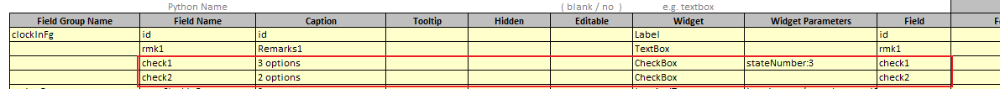
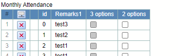

## Function

Adds a button to a table cell that toggles between true and false when
clicked.

In the settings, users can choose whether the number of states is 2 or 3. The
default is 2.

Here is an example:

## Implementation method

### Change in tableUtil.tsx

Add function parsing checkBox parameters

    
    
    export function getTableCheckBoxPrams(table: any) {
      const tableFgCheckBoxPrams = []
      if (table.fields) {
        for (let index = 0; index < table.fields.length; index++) {
          const field = table.fields[index]
          let prams = {}
          if (field.widget?.trim().toLocaleLowerCase() === "checkbox") {
            if (field.widgetParameter.stateNumber) {
              let stateNumber = field.widgetParameter.stateNumber
              if (stateNumber.startsWith('"') || stateNumber.startsWith("'")) {
                stateNumber = stateNumber.slice(1, -1)
              }
              prams["stateNumber"] = Number(stateNumber)
            } else {
              prams["stateNumber"] = 2
            }
          }
          prams["editable"] = field.editable
          tableFgCheckBoxPrams.push(prams)
        }
      }
      // console.log('tableFgCheckBoxPrams', tableFgCheckBoxPrams);
      return tableFgCheckBoxPrams
    }
    

### Add component CheckCell.tsx

The Null state is only used as the initial state when stateNumber is 3, and
the toggle will only be between true and false.

    
    
    const pyiGlobal = pyiLocalStorage.globalParams
    const iconFalse = pyiGlobal.PUBLIC_URL + "images/checkbox_false.gif"
    const iconTrue = pyiGlobal.PUBLIC_URL + "images/checkbox_true.gif"
    const iconNull = pyiGlobal.PUBLIC_URL + "images/checkbox_null.gif"
    
    const CHECKBOX_STATES = {
        True: "true",
        False: "false",
        Null: "null",
      }
    
    interface ICheckCell {
        stateNumber: 2 | 3
        editable: boolean
        state: string
        active: Point.Point
        initialData: any[]
      }
      
      export const CheckCell: React.FC<ICheckCell> = (props) => {
        const stateNumber = props.stateNumber
        let state = props.state.trim().toLocaleLowerCase()
        if (state !== CHECKBOX_STATES.False && state !== CHECKBOX_STATES.True && state !== CHECKBOX_STATES.Null) {
            if (stateNumber === 2) {
                state = CHECKBOX_STATES.False 
            } else if (stateNumber === 3) {
                state = CHECKBOX_STATES.Null 
            }
        }
    
        const dispatch = useDispatch()
        const setCellData = React.useCallback(
            (active: Point.Point, data: Types.CellBase, initialData?: any[], isCheckbox?: boolean) =>
            dispatch(Actions.setCellData(active, data, initialData, isCheckbox)),
            [dispatch]
        )
    
        const checkClick = () => {
            if (props.editable) {
                setCellData(props.active, { value: getNextValue(state) }, props.initialData)
            }
        }
        const scr = state === CHECKBOX_STATES.False ?  iconFalse : (state === CHECKBOX_STATES.Null ?  iconNull : iconTrue)
      
        return 
    }
    
    
    export function getNextValue(value: string) {
    var nextValue: string
    if (value === CHECKBOX_STATES.False) {
        nextValue = CHECKBOX_STATES.True
    } else if (value === CHECKBOX_STATES.True) {
        nextValue = CHECKBOX_STATES.False
    } else if (value === CHECKBOX_STATES.Null){
        nextValue = CHECKBOX_STATES.False
    }
    return nextValue
    }
    

### Use CheckCell.tsx

    
    
    import { CheckCell } from "./CheckCell"
    ...
    const stateNumber = checkBoxPrams[column - 2].stateNumber
    const editable = checkBoxPrams[column - 2].editable
    ...
    } else if (stateNumber && stateNumber !== 0) {
      return (
        <CheckCell
          stateNumber={stateNumber}
          editable={editable}
          state={String(value)}
          active={{ row: row, column: column }}
          initialData={initialData}
        />
      )
    }
    

