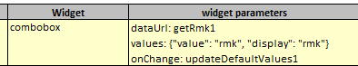
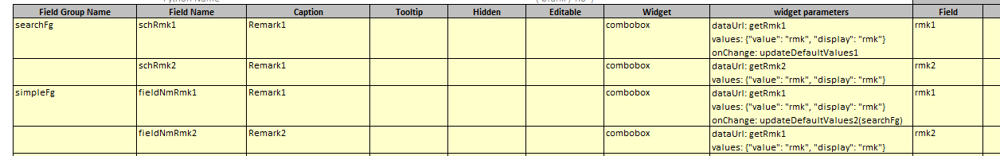

## Function

Set the widget of a line to combobox in simpleFg or searchFg. And set the
widget parameters of this line to with 3 parameters: dataUrl, values and
onchange. Example:

"dataUrl" is necessary, The dropdown box needs to get all the options selected
by the dropdown box by this method.

"values" is not necessary, the default value is "{value: 'value', display:
'display'}". Each option of the drop-down box has a display value and an
actual value, and this parameter is used to specify which property is the
actual value and which property is the display value of each option in the
obtained data.

"onchange" is not necessary, If this parameter is set, this method will be
triggered when combobox change options; all the data in the current page will
be passed to the backend, and then the method will decide whether to refresh
the specified table or refresh the whole page according to the parameters it
comes with, and the default is to refresh the whole page.

### Usage

First set up two comboboxes in excel in searchFg and simpleFg, and then set up
an onchange method in the first combobox of each table.

Then set up two onchange methods in the backend.

    
    
    def updateDefaultValues1(self):
        return self.saveSessionAndResponse(requestParamters={'schData': True})
    
    def updateDefaultValues2(self):
        simpleData = devDemoGetRequestData(self.request).get("simpleFg")
        simpleData = json.loads(simpleData)
        simpleData['rmk2'] = simpleData['rmk1']
        return self._returnQueryResult('searchFg', simpleData)
    

Example:

## Implementation method

### ComboBox.tsx

    
    
    interface IComboBox {
      ref: any
      comboBoxLabel: string
      comboBoxParameter: any
      data?: any
      dataField?: string
      // value?: string
      require: boolean
      name: string
      editable: boolean
      onChangeEvent?: any
    }
    const ComboBox: React.FC<IComboBox> = forwardRef((props, ref: Ref<any>) => {
      const value = props.data[props.dataField] ? props.data[props.dataField] : props.data[props.name]
      const [selectValue, setSelectValue] = useState<string>(value)
      const [valueAndDisplay, setValueAndDisplay] = useState([])
    
      useEffect(() => {
        setSelectValue(value)
      }, [value])
    
      const data = props.comboBoxParameter.data
      let values = props.comboBoxParameter.values
      const dataUrl = props.comboBoxParameter.dataUrl
      const onChange = props.comboBoxParameter.onChange
      useEffect(() => {
        if (data) {
          if (typeof data === "string") {
            setValueAndDisplay(JSON.parse(data))
          } else if (Array.isArray(data)) {
            if (typeof data[0] !== "object") {
              let options = []
              data.map((option) => {
                options.push({ value: String(option), display: String(option) })
              })
              setValueAndDisplay(options)
            } else {
              setValueAndDisplay(data)
            }
          }
        } else if (dataUrl) {
          if (values) {
            values = JSON.parse(values)
          } else {
            values = {value: 'value', display: 'display'}
          }      
          HttpPost(dataUrl, JSON.stringify({useDataUrl: true}))
            .then((response) => response.json())
            .then((result) => {
              if (result.data) {
                let options = []
                result.data.map((option) => {
                  options.push({ value: option[values.value], display: option[values.display] })
                })
                setValueAndDisplay(options)
              }
            })
        }
      }, [props.comboBoxParameter])
    
      const changeSelectedValue = (e: ChangeEvent<HTMLSelectElement>) => {
        setSelectValue(e.target.value)
    
        if (onChange && props.onChangeEvent) {
          let func, prams
          if (onChange.indexOf("(") !== -1) {
            func = onChange.slice(0, onChange.indexOf("("))
            prams = onChange.slice(onChange.indexOf("(") + 1, onChange.indexOf(")")).split(",")
          } else {
            func = onChange
            prams= []
          }
          props.onChangeEvent({func: func, prams: prams})
        }
      }
    
      const comboBoxNode = React.useMemo(
        () => (
          <>
          <th className="property_key">{props.comboBoxLabel}</th>
          <td className="property_value">
            <select ref={ref} name={props.name} id={props.name} value={selectValue ? selectValue : ""} onChange={changeSelectedValue} disabled={!props.editable}>
              {!props.require ? <option key="" value=""></option> : null}
              {valueAndDisplay &&
                valueAndDisplay.length > 0 &&
                valueAndDisplay.map((item: any, index) => (
                  <option key={index} value={item["value"]}>
                    {item["display"]}
                  </option>
                ))}
            </select>
          </td>
        </>
        ),
        [changeSelectedValue, props.comboBoxLabel, props.editable, props.name, props.require, ref, selectValue, valueAndDisplay]
      )
      
      return (
        <>
          {comboBoxNode}
        </>
      )
    })
    export default ComboBox
    

### Screen.tsx

Add an event that fires when the combobox changes, pass all the data from the
current page to the backend, and then decide whether to refresh the whole page
or some tables based on fieldgroups

    
    
    const comboBoxOnChange = async (e: any) => {
      let removeLoadingDiv = true
      Loading.show()
      pyiLocalStorage.clearSysMsgs()
      const eventHandler = e.eventHandler.func
      if (!eventHandler) {
        Loading.remove()
        return
      }
      const fieldgroups = e.eventHandler.prams
      let data = {}
      props.fgNames.map((fgName: string) => {
        data[fgName] = createDatabyFgName(fgName, screenJson, refs)
      })
      try {
        await HttpPost(eventHandler, JSON.stringify(data))
          .then((response) => {
            if (response.ok) return response.json()
            throw response
          })
          .then((result) => {
            if (fieldgroups.length === 0) {
              refreshList()
              removeLoadingDiv = false
            }
            if (validateResponse(result, true)) {
              let fgName
              let fgData
              // YL, 2023-02-09 check is array - bugfix
              result.data &&
                Array.isArray(result.data) &&
                result.data.map((fgNmAndData) => {
                  fgName = fgNmAndData[pyiGlobal.SCREEN_FIELD_GROUP_NAME]
                  fgData = fgNmAndData[pyiGlobal.SCREEN_FIELD_GROUP_DATA]
                  if (fieldgroups.indexOf(fgName) !== -1) {
                    pageRefreshFlag[fgName] += 1
                    screenJson[fgName].data = fgData // reset table data
                  }
                })
              setPageRefreshFlag(JSON.parse(JSON.stringify(pageRefreshFlag))) 
            }
          })
      } catch (error) {
        Loading.remove()
        pyiLogger.error(eventHandler + " error: " + error, true)
      } finally {
        if (removeLoadingDiv) {
          Loading.remove()
        }
      }
    }
    

