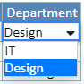
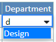
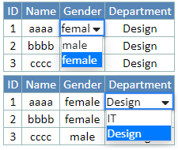

## Usage

### Behaviour of keys

down arrow  | when the dropdown is close, open the dropdown; when the dropdown is open, move focus to next item   
---|---  
up arrow  | move focus to previous item   
enter  | select focused item   
any key  | search list for item starting with key   
home  | move focus to first item   
end  | move focus to last item   
alt + down arrow  | open dropdown   
alt + up arrow  | close dropdown   
  
### Examples

When users open a dropdown

When users input a key to search

### How to add Combo in Spreadsheet

There are two parameters in Spreadsheet props

comboColumns  | number[]  | Define which column is a combo   
---|---|---  
comboSelections  | Array<Array<{id: string, value: string}>> | The corresponding selections for each combo column   
  
They are optional. If specifying certain columns to be the combo, users can
utilize them as shown below.

    
    
    <Spreadsheet 
      comboColumns={[2, 3]}
      comboSelections={[
            [{id: "1", value: "male"}, {id: "2", value: "female"}], 
            [{id: "1", value: "IT"}, {id: "2", value: "Design"}],
          ]}
    />
    

Users can get the combo in the corresponding columns.

## Programs

### Spreadsheet.tsx

Modify Props

    
    
    /** The Spreadsheet component props */
    export type Props<CellType extends Types.CellBase> = {
      ...
      /** Define which column is a combo */
      comboColumns?: number[];
      /** The corresponding selections for each combo column */
      comboSelections?: Array<Array<{id: string, value: string}>>;
    };
    

Modify Spreadsheet

    
    
    const Spreadsheet = <CellType extends Types.CellBase>(
      props: Props<CellType>
    ): React.ReactElement => {
    
      const {
        ...
        comboColumns,
        comboSelections,
      } = props;
    
      const activeCellNode = React.useMemo(
        () => (
          <ActiveCell
            ...
            // @ts-ignore
            ComboColumns={comboColumns}
            // @ts-ignore
            ComboSelections={comboSelections}
            />
        ),
        [..., comboColumns, comboSelections]
      );
    };
    

### type.ts

Modify DataEditorProps

    
    
    export type DataEditorProps<Cell extends CellBase = CellBase> =
      DataComponentProps<Cell> & {
        ...
        /** Define which column is a combo */
        comboColumns?: number[];
        /** The corresponding selections for each combo column */
        comboSelections?: Array<Array<{id: string, value: string}>>;
      };
    

### ActiveCell.tsx

Modify Props

    
    
    type Props = {
      ...
      ComboColumns: number[];
      ComboSelections: Array<Array<{id: string, value: string}>>;
    };
    

Modify ActiveCell

    
    
    const ActiveCell: React.FC<Props> = (props) => {
      const { ComboColumns, ComboSelections } = props;
    
      ...
    
      return hidden ? null : (
        

          {mode === "edit" && active && (
            <DataEditor
              row={active.row}
              column={active.column}
              cell={cell}
              // @ts-ignore
              onChange={handleChange}
              exitEditMode={view}
              comboColumns={ComboColumns}
              comboSelections={ComboSelections}
            />
          )}
        

      );
    };
    

### DataEditor.tsx

Install react-widgets

    
    
    npm install react-widgets --save
    

Modify DataEditor

    
    
    import * as React from "react";
    import * as Types from "./types";
    import { moveCursorToEnd } from "./util";
    import DropdownList from "react-widgets/DropdownList";
    import "./Combo.css";
    
    
    /** The default Spreadsheet DataEditor component */
    const DataEditor: React.FC<Types.DataEditorProps> = ({ onChange, cell, column, comboColumns, comboSelections }) => {
      var isComboColumn = false
      const defaultOption = {id: "", value: ""}
      var options: Array<{id: string, value: string}> = [defaultOption]
      if ((typeof(comboColumns) != "undefined") && (typeof(comboSelections) != "undefined")) {
        for (var i = 0; i < comboColumns.length; i++) {
          if ((comboColumns[i] == column) && 
          (i < comboSelections.length) && 
          (typeof(comboSelections[i]) != "undefined") && 
          (comboSelections[i].length > 0)) {
            isComboColumn = true
            options = comboSelections[i]
          }
        }
      }
    
      const inputRef = React.useRef<HTMLInputElement>(null);
    
      const handleChange = React.useCallback(
        (event: React.ChangeEvent<HTMLInputElement>) => {
          onChange({ ...cell, value: event.target.value });
        },
        [onChange, cell]
      );
    
      React.useEffect(() => {
        if (inputRef.current) {
          moveCursorToEnd(inputRef.current);
        }
      }, [inputRef]);
    
      const value = cell?.value ?? "";
    
      const [id, setId] = React.useState(value)
      const handleDropdownList = React.useCallback(
        (nextValue) => {
          setId(nextValue.id);
          onChange({ ...cell, value: nextValue.value });
        }, [onChange, cell, setId]
      );
    
      return (
        

          {isComboColumn ?
          <DropdownList
            data={options}
            dataKey='id'
            textField='value'
            autoFocus={true}
            value={id}
            onChange={handleDropdownList}
            messages={{emptyFilter: "", emptyList: ""}}
          />
          :
          <input
            ref={inputRef}
            type="text"
            onChange={handleChange}
            value={value}
            autoFocus
          />
          }
        

      );
    };
    
    export default DataEditor;
    

