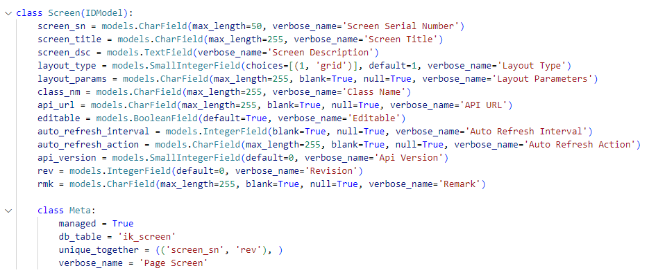

## Screen

screen_sn: Screen serial number

screen_title: Screen title.

screen_dsc: Screen Description. In most cases, the actual value is the same as
the screen title.

layout_type: Layout type. Choose in 'grid' or null.

layout_params: Layout parameters. Enter specific parameters here when layout
type is 'grid'.

class_nm: Class Name. Points to the location of the corresponding class in the
backend of this page.

api_url: API URL. The url used to open this page.

editable: Set whether the entire page is editable.

auto_refresh_interval: Automatically trigger time for auto-trigger events.

auto_refresh_action: Automatically triggered events for auto-triggered events.

api_version: Api version.

rev: Revision.

## Screen Recordset

screen: Foreign keys for Screen table.

recordset_nm: The most important setting. Each tableFg and some searchFg and
some comboBox need a Recordset Name to retrieve their display content. After
setting the recordset name, a corresponding [get + recordset name] method on
the backend is required to return the specific content.

seq: The order in which recordset is displayed in the table

sql_models: May point to a table that actually exists in the database, or it
may point to a dummy model. The dummy model is usually used to set initial
values for schFg, or for page tables that are related to multiple database
tables.

sql_fields/sql_where/sql_order/sql_limit: When the sql_models column refers to
a specific database table, These columns contain parameters used for querying
content from the database.

## Screen Field Group

screen: Foreign keys for Screen table.

fg_nm: Field group name.

fg_type: Field group type. Choose in
["table"/"fields"/"iconBar"/"resultTable"/"search"/"html"/"iframe"/"viewer"/"sitePlan"]

caption: Field group caption.

recordset: Name of the recordset defined in the recordset table.

deletable / editable: True or Fales

insertable / highlight_row: True or Fales. Only used in table ande
resultTable.

selection_mode: Choose in "single " or "multiple" or blank, Only used in table
and resultTable.

cols: Number of fields in a row, Only used in fields and search.

data_page_type: Choose in "client" or "server" or blank, Only used in table
and resultTable. Used to set up table paging.

data_page_size: Setting the length of each page in paging after setting up
table paging.

outer_layout_params: Sets the position of each field group in the grid layout.

inner_layout_type / inner_layout_params: These two parameters are not
currently used.

html: Directly set the display content of the html component. Only used in
html

additional_props: Other parameters.

## Screen Field

screen: Foreign keys for Screen table.

field_group: Foreign keys for Screen Field Group table.

field_nm: Field unique name.

seq: The order in which the field is displayed on the field group.

caption: Field caption.

tooltip: Set the tooltip of field.

visible / editable: True or False.

db_unique / db_required: True or False. Set this field is Unique / Required or
not in database.

widget: Field Widget, choose in
["Label"/"TextBox"/"TextArea"/"DateBox"/"ComboBox"/"ListBox"/"CheckBox"/"Button"/"IconAndText"/"File"/"Plugin"/"Html"/"AdvancedComboBox"/"Password"/"AdvancedSelection"].

widget_parameters: [Widget Parameters](Widget_Parameters.md "Widget
Parameters")

db_field: Field corresponds to the name of the database field.

event_handler: Backend method name for button click event requests.

styles: Set the style of this field.

## Screen Field Group Link

screen: Foreign keys for Screen table.

field_group / parent_field_group: Foreign keys for Screen Field Group table.

local_key: Related field in field group.

parent_key: Related field in parent field group.

## Screen Field Group Header Footer

screen: Foreign keys for Screen table.

field_group: Foreign keys for Screen Field Group table.

field: Foreign keys for Screen Field table.

header_level1 / header_level2 / header_level3: Table header.

footer: Table footer.

