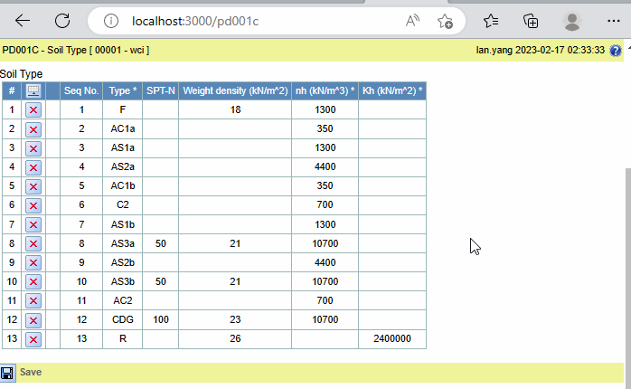

## Function

Show a download button when the mouse moves to the column header. Click this
button to download the contents of the current table.

### Module

Introduce a new third-party module react-csv to export csv files.

This is the link to the home page of this module, other api can be viewed
here: <https://www.npmjs.com/package/react-csv>

    
    
    npm install react-csv
    npm i --save-dev @types/react-csv
    

### Usage

Here is an example about export CSV file:

## Implementation method

### Change in ColumnIndicator.tsx

Add a mouse-Enter event named "showExportIcon" for the column header, Show the
download icon when the mouse moves to the column header.

Add a mouse-Leave event named "hideExportIcon" for the column header, Delay
two seconds to hide the download icon when the mouse leaves the column header.

    
    
    ...
    let timeOutFunc = null
    const handleMouseEnter = React.useCallback(
      (event: React.MouseEvent) => {
        clearTimeout(timeOutFunc)
        onMouseEnter(column, event.shiftKey)
      },
      [column, onMouseEnter]
    )
    const handleMouseLeave = React.useCallback(
      (event: React.MouseEvent) => {
        timeOutFunc = setTimeout(function () {
          onMouseLeave(column, event.shiftKey)
        }, 2000)
      },
      [column, onMouseLeave]
    )
    return (
        <th
          ...
          onMouseEnter={handleMouseEnter}
          onMouseLeave={handleMouseLeave}
        >
          ...
        </th>
    )
    
    
    
    ...
    const showExportIcon = React.useCallback(
      (column: number, extend: boolean) =>
        dispatch(Actions.showExportIcon(column, extend)),
      [dispatch]
    )
    const hideExportIcon = React.useCallback(
      (column: number, extend: boolean) =>
        dispatch(Actions.hideExportIcon(column, extend)),
      [dispatch]
    )
    return (
      <ColumnIndicatorComponent
        ...
        onMouseEnter={showExportIcon}
        onMouseLeave={hideExportIcon}
      />
    )
    

### Change in reducer.ts and actions.ts

Write the specific logic of the functions in actions.ts, and configure the
corresponding functions.

actions.ts:

    
    
    export const showExportIcon = createAction<
      (
        column: number,
        extend: boolean
      ) => { payload: { column: number; extend: boolean } },
      "SHOW_EXPORT_ICON"
    >("SHOW_EXPORT_ICON", (column, extend ) => ({
      payload: { column, extend },
    }));
    export const hideExportIcon = createAction<
      (
        column: number,
        extend: boolean
      ) => { payload: { column: number; extend: boolean } },
      "HIDE_EXPORT_ICON"
    >("HIDE_EXPORT_ICON", (column, extend ) => ({
      payload: { column, extend },
    }));
    

Add a new state named exportCSV in INITIAL_STATE, show export icon only when
it is true.

reducer.ts:

    
    
    export const INITIAL_STATE: Types.StoreState = {
      ...
      exportCSV: false,
    }
    builder.addCase(Actions.showExportIcon, (state, action) => {
      return {
        ...state,
        exportCSV: true
      }
    })
    builder.addCase(Actions.hideExportIcon, (state, action) => {
      return {
        ...state,
        exportCSV: false
      }
    })
    

### Change in TableFg.tsx

Because this plugin can only be displayed as a button when export table, we
need hide this button and add a icon that set a click event to click the
hidded button.

    
    
    import ReactHTMLTableToExcel from 'react-html-table-to-excel';
    import moment from "moment"
    
    {showTopIcon ? (
      <>
        </img>
         document.getElementById('table-xls-button').click()}></img>
        <ReactHTMLTableToExcel
          id="table-xls-button"
          className="download-table-xls-button"
          table={"table " + name}
          filename={(caption ? caption.replace(/\ /g,'_') : name) + "-" + moment().format("YYYYMMDDHHmmss")}
          // sheet="tablexls"
        />
        </img>
      </>
    ) : null}
    

