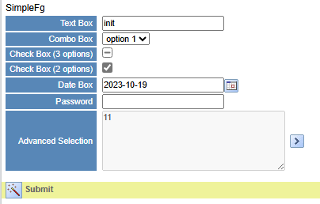

## Project UI

  * Page UI

## Project Django Rest Framework Part

### Entry function

    
    
    #!/usr/bin/env python
    """Django's command-line utility for administrative tasks."""
    import os
    import sys
    
    
    def main():
        """Run administrative tasks."""
        os.environ.setdefault('DJANGO_SETTINGS_MODULE', 'pyi.settings')
        try:
            from django.core.management import execute_from_command_line
        except ImportError as exc:
            raise ImportError(
                "Couldn't import Django. Are you sure it's installed and "
                "available on your PYTHONPATH environment variable? Did you "
                "forget to activate a virtual environment?"
            ) from exc
        execute_from_command_line(sys.argv)
    
    
    if __name__ == '__main__':
        main()
    

### Model

    
    
    Create office model
    
    
    from django.db import models
    
    # Create your models here.
    class office(models.Model):
        id = models.AutoField(primary_key=True)
        cre_dt = models.DateTimeField(auto_now=True)
        cre_usr_id = models.BigIntegerField()
        mod_dt = models.DateTimeField(null=True, auto_now=True)
        mod_usr_id = models.BigIntegerField(null=True)
        version_no = models.SmallIntegerField()
        sn = models.SmallIntegerField(unique=True)
        office = models.CharField(max_length=2, unique=True)
        full_nm = models.CharField(max_length=50, unique=True)
        ccy = models.CharField(max_length=3)
        rmk = models.CharField(max_length=255, null=True)
        region_cd = models.CharField(max_length=3)
        company_id = models.BigIntegerField()
        wci_url = models.CharField(max_length=50, null=True)
    
    
    class ccy(models.Model):
        id = models.AutoField(primary_key=True)
        cre_dt = models.DateTimeField(auto_now=True)
        cre_usr_id = models.BigIntegerField()
        mod_dt = models.DateTimeField(null=True, auto_now=True)
        mod_usr_id = models.BigIntegerField(null=True)
        version_no = models.SmallIntegerField()
        ccy = models.CharField(max_length=3, unique=True)
        rmk = models.CharField(max_length=255, null=True)
    

### Serialization

    
    
    Serialize the office's model
    
    
    '''
    Description: 
    version: 
    Author: YL
    Date: 2022-03-24 10:43:00
    LastEditors: YL
    LastEditTime: 2022-03-27 17:16:10
    '''
    from rest_framework import serializers
    from wci.models import office
    from wci.models import ccy
    
    class officeSerializer(serializers.ModelSerializer):
        class Meta:
            model = office
            fields = ('id', 'cre_dt', 'cre_usr_id', 'mod_dt', 'mod_usr_id', 'version_no', 'sn', 'office', 'full_nm', 'ccy',
            'rmk', 'region_cd', 'company_id', 'wci_url')
    
    
    class ccySerializer(serializers.ModelSerializer):
        class Meta:
            model = ccy
            fields = ('id', 'cre_dt', 'cre_usr_id', 'mod_dt', 'mod_usr_id', 'version_no', 'ccy', 'rmk')
    

### Urls

    
    
    Define the django interface url
    
    
    '''
    Description: 
    version: 
    Author: YL
    Date: 2022-03-24 10:43:00
    LastEditors: YL
    LastEditTime: 2022-03-31 10:34:38
    '''
    from django.urls import re_path
    from wci import views
    
    urlpatterns = [
        re_path(r'^office$', views.officeApi),
        re_path(r'^office/([0-9]+)$', views.officeApi),
    
        re_path(r'^ccy$', views.ccyApi),
        re_path(r'^ccy/([0-9]+)$', views.ccyApi),
    
    ]
    

### Interfaces

    
    
    Implementation of interface methods
    
    
    '''
    Description: 
    version: 
    Author: YL
    Date: 2022-03-17 10:46:15
    LastEditors: YL
    LastEditTime: 2022-03-31 10:34:26
    '''
    import json
    from django.shortcuts import render
    from django.views.decorators.csrf import csrf_exempt
    from rest_framework.parsers import JSONParser
    from django.http.response import JsonResponse
    
    from wci.models import office
    from wci.serializers import officeSerializer
    
    from wci.models import ccy
    from wci.serializers import ccySerializer
    
    from wci.utils import modelUtils
    
    # Create your views here.
    
    @csrf_exempt
    def officeApi(request, id=0):
        if request.method == 'GET':
            id = request.GET.get("id")
            offices = office.objects.all()
            if(not id is None and id != 0):
                offices = office.objects.filter(id=id).first()
                offices_serializer = officeSerializer(offices)
            else:
                offices_serializer = officeSerializer(offices, many=True)
            return JsonResponse(offices_serializer.data, safe=False)
        elif request.method == 'POST':
            office_data = JSONParser().parse(request)
            offices_serializer = officeSerializer(data=office_data)
            if offices_serializer.is_valid():
                offices_serializer.save()
                return JsonResponse("Added Successfully", safe=False)
            else:
                ErrorDict = offices_serializer.errors
                Error_Str = json.dumps(ErrorDict)
                Error_Dict = json.loads(Error_Str)
                return JsonResponse("Failed to Add: " + Error_Str, safe=False)
        elif request.method == 'PUT':
            office_data = JSONParser().parse(request)
            office_data = modelUtils.updateSystemFields(office, office_data)
            offices = office.objects.get(id=office_data['id'])
            offices_serializer = officeSerializer(offices, data=office_data)
            if offices_serializer.is_valid():
                offices_serializer.save()
                return JsonResponse("Updated Successfully", safe=False)
            else:
                # get error info
                ErrorDict = offices_serializer.errors
                Error_Str = json.dumps(ErrorDict)
                Error_Dict = json.loads(Error_Str)
                return JsonResponse("Failed to Update: " + Error_Str, safe=False)
        elif request.method == 'DELETE':
            offices = office.objects.get(id=id)
            offices.delete()
            return JsonResponse("Deleted Successfully", safe=False)
    
    
    @csrf_exempt
    def ccyApi(request, id=0):
        if request.method == 'GET':
            id = request.GET.get("id")
            ccys = ccy.objects.all()
            if(not id is None and id != 0):
                ccys = ccy.objects.filter(id=id).first()
                ccys_serializer = ccySerializer(ccys)
            else:
                ccys_serializer = ccySerializer(ccys, many=True)
            return JsonResponse(ccys_serializer.data, safe=False)
        elif request.method == 'POST':
            ccy_data = JSONParser().parse(request)
            ccys_serializer = ccySerializer(data=ccy_data)
            if ccys_serializer.is_valid():
                ccys_serializer.save()
                return JsonResponse("Added Successfully", safe=False)
            else:
                ErrorDict = ccys_serializer.errors
                Error_Str = json.dumps(ErrorDict)
                Error_Dict = json.loads(Error_Str)
                return JsonResponse("Failed to Add: " + Error_Str, safe=False)
        elif request.method == 'PUT':
            ccy_data = JSONParser().parse(request)
            ccys = ccy.objects.get(id=ccy_data['id'])
            ccys_serializer = ccySerializer(ccys, data=ccy_data)
            if ccys_serializer.is_valid():
                ccys_serializer.save()
                return JsonResponse("Updated Successfully", safe=False)
            else:
                # get error info
                ErrorDict = ccys_serializer.errors
                Error_Str = json.dumps(ErrorDict)
                Error_Dict = json.loads(Error_Str)
                return JsonResponse("Failed to Update: " + Error_Str, safe=False)
        elif request.method == 'DELETE':
            ccys = ccy.objects.get(id=id)
            ccys.delete()
            return JsonResponse("Deleted Successfully", safe=False)
    

### Utils

    
    
    Update system fields
    
    
    '''
    Description: update system fields
    version: 
    Author: YL
    Date: 2022-03-31 09:47:38
    LastEditors: YL
    LastEditTime: 2022-03-31 10:28:46
    '''
    
    from time import strftime
    
    def updateSystemFields(model, modelData):
        modelObj = model.objects.get(id=modelData["id"])
        modelData.update(version_no = modelObj.version_no + 1)
        if modelObj.cre_usr_id:
            modelData.update(cre_usr_id = modelObj.cre_usr_id)
            modelData.update(cre_dt = modelObj.cre_dt)
            modelData.update(mod_usr_id = -1) # should get current user id
            modelData.update(mod_dt = strftime("%Y-%m-%d %H:%M:%S"))
        else:
            modelData.update(cre_usr_id = -1) # should get current user id
            modelData.update(cre_dt = strftime("%Y-%m-%d %H:%M:%S"))
        return modelData
    

## Project React + TS Part

### Components

    
    
    Customize the required components

#### Label

‎

    
    
    /*
     * @Description: 
     * @version: 
     * @Author: YL
     * @Date: 2022-03-22 11:41:41
     * @LastEditors: YL
     * @LastEditTime: 2022-03-24 17:30:33
     */
    import React, { useState, forwardRef, Ref } from 'react'
    
    interface ILabel {
      ref: any
      labelLabel: string
      labelValue: string
      name: string
    }
    const Label: React.FC<ILabel> = forwardRef((props, ref: Ref<any>) => {
    
      return (
        <>
          <th className='property_key'>{props.labelLabel}</th>
          <td className='property_value'>
            <input ref={ref} type="hidden" name={props.name} id={props.name} value={props.labelValue}></input>{props.labelValue}
          </td>
        </>
      )
    });
    
    export default Label;
    

#### Textbox

‎

    
    
    /*
     * @Description:
     * @version:
     * @Author: YL
     * @Date: 2022-03-17 13:45:01
     * @LastEditors: YL
     * @LastEditTime: 2022-03-29 18:54:33
     */
    
    import React, { ChangeEvent, forwardRef, Ref, useState } from "react"
    
    interface ITextbox {
      ref: any
      textboxLabel: string
      textboxValue: string
      name: string
      editable: boolean
    }
    const Textbox: React.FC<ITextbox> = forwardRef((props, ref: Ref<any>) => {
      const [textboxValue, setTextboxValue] = useState<string>("")
    
      const changeTextboxValue = (e: ChangeEvent<HTMLInputElement>) => {
        setTextboxValue(e.target.value)
      }
      return (
        <>
          <th className="property_key">{props.textboxLabel}</th>
          <td className="property_value">
            <input
              ref={ref}
              type="Textbox"
              name={props.name}
              id={props.name}
              defaultValue={props.textboxValue}
              onChange={changeTextboxValue}
              disabled={!props.editable}
            />
          </td>
        </>
      )
    })
    
    export default Textbox
    

#### TextArea

‎

    
    
    /*
     * @Description:
     * @version:
     * @Author: YL
     * @Date: 2022-03-17 17:03:45
     * @LastEditors: YL
     * @LastEditTime: 2022-03-31 10:31:11
     */
    import React, { ChangeEvent, useState, forwardRef, Ref, useEffect } from "react"
    
    interface ITextArea {
      ref: any
      textareaLabel: string
      textareaValue: string
      name: string
      editable: boolean
    }
    const TextArea: React.FC<ITextArea> = forwardRef((props, ref: Ref<any>) => {
      const [textareaValue, setTextareaValue] = useState<string>("")
    
      useEffect(() => {
        setTextareaValue(props.textareaValue)
      }, [props.textareaValue])
    
      const changeTextareaValue = (e: ChangeEvent<HTMLTextAreaElement>) => {
        setTextareaValue(e.target.value)
      }
      return (
        <>
          <th className="property_key">{props.textareaLabel}</th>
          <td className="property_value">
            <textarea
              ref={ref}
              name={props.name}
              defaultValue={props.textareaValue}
              value={textareaValue}
              onChange={changeTextareaValue}
              disabled={!props.editable}
            />
          </td>
        </>
      )
    })
    
    export default TextArea
    

#### Checkbox

‎

    
    
    /*
     * @Description:
     * @version:
     * @Author: YL
     * @Date: 2022-03-22 08:58:57
     * @LastEditors: YL
     * @LastEditTime: 2022-03-29 18:01:26
     */
    import React, { useState, ChangeEvent, forwardRef, Ref } from "react"
    
    interface ICheckbox {
      ref: any
      checkboxLabel: string
      checkboxValue: boolean
      name: string
    }
    
    const Checkbox: React.FC<ICheckbox> = forwardRef((props, ref: Ref<any>) => {
      const [checkboxValue, setCheckboxValue] = useState<boolean>(false)
      const changeCheckboxValue = (e: ChangeEvent<HTMLInputElement>) => {
        setCheckboxValue(e.target.checked)
      }
      return (
        <>
          <th className="property_key">{props.checkboxLabel}</th>
          <td className="property_value">
            <input
              ref={ref}
              type="checkbox"
              name={props.name}
              id={props.name}
              value="Y"
              checked={props.checkboxValue}
              onChange={changeCheckboxValue}
            ></input>
          </td>
        </>
      )
    })
    
    export default Checkbox
    

#### ComboBox

‎

    
    
    /*
     * @Description:
     * @version:
     * @Author: YL
     * @Date: 2022-03-17 17:03:57
     * @LastEditors: YL
     * @LastEditTime: 2022-03-30 16:35:58
     */
    import React, { ChangeEvent, useState, forwardRef, Ref } from "react"
    import { useEffect } from "react"
    
    interface IComboBox {
      ref: any
      comboBoxLabel: string
      comboBoxValue: Array<JSON>
      selectValue: string
      require: boolean
      name: string
      editable: boolean
    }
    const ComboBox: React.FC<IComboBox> = forwardRef((props, ref: Ref<any>) => {
      const [selectValue, setSelectValue] = useState<string>(props.selectValue)
    
      useEffect(() => {
          setSelectValue(props.selectValue)
      }, [props.selectValue])
      
      const changeSelectedValue = (e: ChangeEvent<HTMLSelectElement>) => {
        setSelectValue(e.target.value)
      }
      return (
        <>
          <th className="property_key">{props.comboBoxLabel}</th>
          <td className="property_value">
            <select
              ref={ref}
              name={props.name}
              id={props.name}
              value={selectValue}
              onChange={changeSelectedValue}
              disabled={!props.editable}
            >
              {!props.require ? <option key="" value=""></option> : null}
              {props.comboBoxValue.map((item: any, index) => (
                <option key={index} value={item.key}>
                  {item.value}
                </option>
              ))}
            </select>
          </td>
        </>
      )
    })
    
    export default ComboBox
    

#### ImageButton

‎

    
    
    /*
     * @Description:
     * @version:
     * @Author: YL
     * @Date: 2022-03-16 15:34:11
     * @LastEditors: YL
     * @LastEditTime: 2022-03-30 10:39:02
     */
    
    import React, { useState, useEffect, ReactNode, MouseEvent } from "react"
    
    interface IImageButton {
      caption: ReactNode
      name: string
      widgetParameter: string
      clickEvent: any
    }
    
    const ImageButton: React.FC<IImageButton> = (props) => {
      // get imgage under "src"
      let imgUrl = props.widgetParameter
      const reqSvgs = require.context("../", true, /\.(gif|png|jpg)$/)
      reqSvgs(imgUrl)
      const allSvgFilepaths = reqSvgs.keys()
      const imagePath = allSvgFilepaths[0]
      const image = reqSvgs(imagePath)
    
      return (
        <>
          
          &nbsp;{props.caption}&nbsp;&nbsp;
        </>
      )
    }
    
    export default ImageButton
    

### Office data

    
    
    Simulation, should get from django

‎

    
    
    {
      "caption": "Office Caption",
      "name": "officeFg",
      "recordset": "wciCcy",
      "controllable": true,
      "editable": true,
      "deleteable": false,
      "fields": [
        {
          "caption": "SN",
          "name": "snField",
          "field": "sn",
          "recordsetField": "",
          "recordsetKey": "",
          "editable": true,
          "enabled": true,
          "required": true,
          "widget": "label",
          "widgetParameter": "",
          "tooltip": "",
          "eventHandler": ""
        },
        {
          "caption": "Office",
          "name": "officeField",
          "field": "office",
          "recordsetField": "",
          "recordsetKey": "",
          "editable": true,
          "enabled": true,
          "required": true,
          "widget": "textbox",
          "widgetParameter": "",
          "tooltip": "",
          "eventHandler": ""
        },
        {
          "caption": "Full Name",
          "name": "fullNmField",
          "field": "full_nm",
          "recordsetField": "",
          "recordsetKey": "",
          "editable": true,
          "enabled": true,
          "required": true,
          "widget": "textbox",
          "widgetParameter": "",
          "tooltip": "",
          "eventHandler": ""
        },
        {
          "caption": "CCY",
          "name": "ccyField",
          "field": "ccy",
          "recordsetField": [
            { "key": "HKD", "value": "HKD" },
            { "key": "RMB", "value": "RMB" },
            { "key": "SGD", "value": "SGD" },
            { "key": "IDR", "value": "IDR" },
            { "key": "USD", "value": "USD" },
            { "key": "EUR", "value": "EUR" },
            { "key": "GBP", "value": "GBP" }
          ],
          "recordsetKey": "ccy",
          "editable": true,
          "enabled": true,
          "required": true,
          "widget": "comboBox",
          "widgetParameter": "",
          "tooltip": "",
          "eventHandler": ""
        },
        {
          "caption": "WCI Url",
          "name": "wciUrlField",
          "field": "wci_url",
          "recordsetField": "",
          "recordsetKey": "",
          "editable": false,
          "enabled": true,
          "required": true,
          "widget": "textbox",
          "widgetParameter": "",
          "tooltip": "",
          "eventHandler": ""
        },
        {
          "caption": "Region CD",
          "name": "regionCdField",
          "field": "region_cd",
          "recordsetField": "",
          "recordsetKey": "",
          "editable": true,
          "enabled": true,
          "required": true,
          "widget": "textbox",
          "widgetParameter": "",
          "tooltip": "",
          "eventHandler": ""
        },
        {
          "caption": "company_id",
          "name": "companyIdField",
          "field": "company_id",
          "recordsetField": "",
          "recordsetKey": "",
          "editable": true,
          "enabled": true,
          "required": true,
          "widget": "textbox",
          "widgetParameter": "",
          "tooltip": "",
          "eventHandler": ""
        },
        {
          "caption": "Remark",
          "name": "rmkField",
          "field": "rmk",
          "recordsetField": "",
          "recordsetKey": "",
          "editable": true,
          "enabled": true,
          "required": true,
          "widget": "textArea",
          "widgetParameter": "",
          "tooltip": "",
          "eventHandler": ""
        }
      ],
      "toolbar": {
        "name": "boolbar",
        "btnArr": [
          {
            "caption": "Save",
            "name": "saveBtn",
            "widget": "ImageButton",
            "widgetParameter": "./images/action_button.gif",
            "eventHandler": "saveFunc"
          },
          {
            "caption": "Delete",
            "name": "delBtn",
            "widget": "ImageButton",
            "widgetParameter": "./images/action_button.gif",
            "eventHandler": "delFunc"
          }
        ]
      }
    }
    

### Office page

    
    
    Implementation of pages and features

‎

    
    
    /*
     * @Description:
     * @version:
     * @Author: YL
     * @Date: 2022-03-22 13:18:33
     * @LastEditors: YL
     * @LastEditTime: 2022-03-31 10:29:32
     */
    import React, { useState, useEffect, useRef, MutableRefObject } from "react"
    import { variables } from "../variables"
    import "../components/style-v1.css"
    import fgData from "./office.json"
    import SimpleFieldGroup from "../components/SimpleFieldGroup"
    import ImageButton from "../components/ImageButton"
    
    const Office = () => {
      const [currentData, setCurrentData] = useState(Object)
      const simpleFieldGroupRef = useRef<any>(null)
    
      useEffect(() => {
        refreshList()
      }, []) // page refresh
    
      // set page data
      const refreshList = () => {
        fetch(variables.API_URL + "office?id=1") // call djiango's api to get the data
          .then((response) => response.json())
          .then((data) => {
            setCurrentData(data)
          })
      }
    
      const handleClick = (eventHandler: string) => {
        if (eventHandler === "saveFunc") {
          saveFunc()
        } else if (eventHandler === "delFunc") {
          console.log("delete something")
        }
      }
    
      // Save button event
      const saveFunc = () => {
        fetch(variables.API_URL + "office", {
          // call djiango's api to submit the data
          method: "PUT",
          headers: {
            Accept: "application/json",
            "Content-Type": "application/json",
          },
          body: simpleFieldGroupRef.current.formDataToJson(currentData["id"]), // get form json data
        })
          .then((res) => res.json())
          .then(
            (result) => {
              alert(result)
            },
            (error) => {
              alert("Failed")
            }
          )
      }
      // get specified form field data
      const getFieldData = function (
        simpleFieldGroupRef: MutableRefObject<any>,
        fieldNm: string
      ): string {
        return simpleFieldGroupRef.current?.refs[fieldNm].current?.value
      }
    
      return (
        <>
          <SimpleFieldGroup
            ref={simpleFieldGroupRef}
            caption={fgData.caption}
            name={fgData.name}
            recordset={fgData.recordset}
            controllable={fgData.controllable}
            editable={fgData.editable}
            deleteable={fgData.deleteable}
            fields={fgData.fields}
            toolbar={fgData.toolbar}
            data={currentData}
          />
    
          {fgData.toolbar.btnArr ? (
            

              {fgData.toolbar.btnArr.map((btn, index) => (
                <ImageButton
                  key={index}
                  caption={btn.caption}
                  name={btn.name}
                  widgetParameter={btn.widgetParameter}
                  clickEvent={() => handleClick(btn.eventHandler)}
                />
              ))}
            

          ) : null}
        </>
      )
    }
    
    export default Office
    

### React homepage

    
    
    Add Office components to the react homepage

‎

    
    
    /*
     * @Description: 
     * @version: 
     * @Author: YL
     * @Date: 2022-03-16 15:27:10
     * @LastEditors: YL
     * @LastEditTime: 2022-03-23 16:30:45
     */
    import React from 'react';
    import './App.css';
    import Office from './screen/Office';
    
    function App() {
      return (
        

          <Office />
        

      );
    }
    
    export default App;
    

## Usage

### Multi column and group Title

Modify Json

    
    
    "simpleFg": {
    
        ...
    
        "cols":3,
        "fields": [
          {
            "groupTitle":"aaa"
          },
          {
            "caption": "SN",
            "name": "snField",
            "dataField": "sn",
            "recordsetField": "",
            "recordsetKey": "",
            "editable": true,
            "enabled": true,
            "required": true,
            "widget": "label",
            "widgetParameter": "",
            "tooltip": "",
            "eventHandler": ""
          },
          {
            "caption": "Office",
            "name": "officeField",
            "dataField": "office",
            "recordsetField": "",
            "recordsetKey": "",
            "editable": true,
            "enabled": true,
            "required": true,
            "widget": "textbox",
            "widgetParameter": "",
            "tooltip": "",
            "eventHandler": ""
          },
    
          ...
    

set row

    
    
    export function SetRows(fields:any[],column:number){
      let rows=[]
      let row1: any[]=[]
      let column_index=1
      fields.map((field)=>{
        // console.log(field.groupTitle)
          if(field.groupTitle!==undefined){
            if(row1!==undefined){
              rows.push(row1)
              row1=[]
            }     
            column_index=column
          }
          row1.push(field)
          if(column_index==column){
            rows.push(row1)
            column_index=1
            row1=[]
          }else{
            column_index=column_index+1
          }     
        }
      )
    
      if(row1!==[]){
        rows.push(row1)
      }
    
      return rows
    }
    

