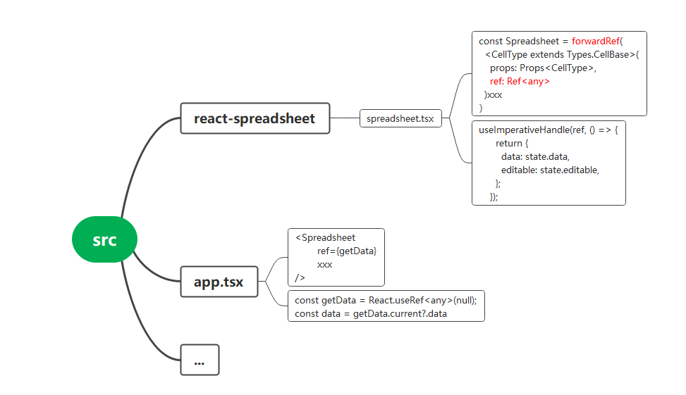

## The forwardRef can forward the ref to the child component，use hooks
useImperativeHandle forward a part of ref. Such as only forward data:

    
    
    import { forwardRef, Ref, useImperativeHandle } from "react";
    const Spreadsheet = forwardRef(
      <CellType extends Types.CellBase> (
        props: Props<CellType>,
        ref: Ref<any>
      ): React.ReactElement => {
         useImperativeHandle(ref, () => {
          return {
            data: state.data,
          };
        });
         xxx // The content of the component
     }
    )
    {{highlight | text }}
    

## Use data outside component

    
    
    const getData = React.useRef<any>(null);
    const data = getData.current?.data
    return (
      <Spreadsheet  // component name
        ref={getData}
        xxx  // other props
      />
    

## Mindmap:

Get data outside compont

For a more in-depth understanding of how they work users can find more
information here：<https://www.jianshu.com/p/07546bee4a7c>

