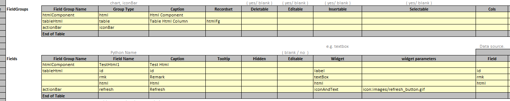

## Function

Generate a div in the page that displays the entire html page or a small piece
of html code fetched by the html component.

## Pre-processing

Set Field Group Name and Group Type of html component in excel. Set Group Type
to 'html'.

  
Add a function to get the html file in the backend, the function name is
determined by Field Group Name.

Function name = 'getHrml' + Field Group Name

    
    
    def getHtmlHtmlComponent(self):
        f = './var/devdemo/htmlExample.html'
        with open(f, 'r', encoding='utf-8') as f:
            content = f.read()
        return PyiSccJsonResponse(data=content)
    

## Component Implementation Method

Request the corresponding function on the back end according to the url of the
html file passed in the parameters, get the corresponding html file and
display it.

Get the html file:

    
    
    interface HtmlPrams {
      resources: any
      params: any
    }
    
    const Html: React.FC<HtmlPrams> = (props) => {
      const data = props.params.data
      const dataUrl = props.params.dataUrl
    
      const [htmlPrams, setHtmlPrams] = React.useState("")
    
      React.useEffect(() => {
        if (data) {
          setHtmlPrams(data)
        } else if (dataUrl) {
          HttpGet(dataUrl)
            .then((response) => response.json())
            .then((result) => {
              if (validateResponse(result, false)) {
                setHtmlPrams(result.data)
              }
            })
        }
      }, [props.params])
      
    
      ......
      // Parsing to get the html file and display it
    
    
      return 

 // YL, 2022-12-06 bugfix if htmlParams is null
    }
    
    export default Html
    

Parsing to get the html file and display it:

    
    
    React.useEffect(() => {
      const cont = document.getElementById(props.params.name)
      cont.innerHTML = htmlPrams
      const oldScripts = cont.getElementsByTagName("script")
      const scriptLen = oldScripts.length
      let jsFilesNum = 0
      let content
      for (var i = 0; i < scriptLen; i++) {
        let oldScript = oldScripts[0]
        let newScript = document.createElement("script")
    
        if (oldScript) {
          cont.removeChild(oldScript)
          newScript.type = "text/javascript"
          if (oldScript.src) {
            newScript.src = oldScript.src
            // eslint-disable-next-line no-loop-func
            newScript.onload = newScript.onratechange = function () {
              jsFilesNum += 1
              if (jsFilesNum > 0 && scriptLen - 1 === jsFilesNum) {
                let sc = document.createElement("script")
                sc.type = "text/javascript"
                sc.innerHTML = content
                const cont = document.getElementById(props.params.name)
                cont.appendChild(sc)
              }
            }
            cont.appendChild(newScript)
          } else if (oldScript.innerHTML) {
            newScript.type = "text/javascript"
            newScript.innerHTML = oldScript.innerHTML
            content = oldScript.innerHTML
            if (scriptLen == 1) {
              // only have script content
              cont.appendChild(newScript)
            }
          }
        }
        if (Object.keys(props.resources).length > 0) {
          props.resources.map((resource) => {
            addStaticResource(resource)
          })
        }
      }
    }, [htmlPrams])
    

