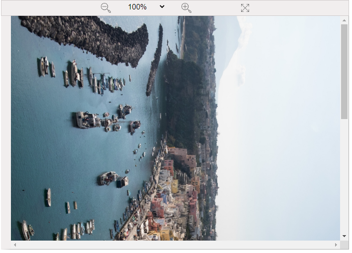

## Usage

### Interface

### Install the package

    
    
    npm install react-viewer --save
    

### ImgViewer.tsx

    
    
    import React, { useEffect, useState } from "react";
    import Viewer from 'react-viewer';
    
    interface IImgViewer {
        fileUrl: string;
    
        //px
        disWidth?:number;
        disHeight?:number;
    }
    
    const ImgViewer: React.FC<IImgViewer>=({fileUrl,disWidth,disHeight})=>{
    
        const [scale,setScale]=useState(1)
        const [divHeight,setDivHeight]=useState(disHeight?disHeight:500)
        const [divWidth,setDivWidth]=useState(disWidth?disWidth:700)
        const [imgWidth,setImgWidth]=useState(divWidth)
        const [imgOWidth,setImgOWidth]=useState<number>(1)
        const [imgOHeight,setImgOHeight]=useState<number>(1)
    
    
        const [ visible, setVisible ] = React.useState(false);
    
        // var fileUrl=require( '../images/testImg.jpg')
    
        useEffect(()=>{
            setImgWidth((divWidth-38)*scale)
    
        },[scale])
        
    
        function loadImgFile(event:any){
            setImgOHeight(event.target.height)
            setImgOWidth(event.target.width)
    
    
    
        }
    
    
        function changeScale(event:any){
            let ss=event.target.value
            if(ss.trim()==="fitPage"){
                fitPage()
            }
            else if(ss.trim()==="fitWidth"){
                fitWidth()
    
            }
            else{
                let s=ss.slice(0,ss.length-1)/100
                setScale(s)
    
            }
            
        }
    
        function zoomOut(){
            setScale(scale-0.1)
        }
    
        function zoomIn(){
            setScale(scale+0.1)
        }
    
        function fitWidth(){
            setScale((divWidth-38)/imgOWidth)
        }
    
        function fitPage(){
            let fitS=Math.min((divWidth-38)/imgOWidth,(divHeight-58)/imgOHeight)
            setScale(fitS)
        }
    
    
        const scaleOptionList=["50%","70%","100%","120%","150%","200%","300%","400%"]
    
        let scaleDis=String(Math.round(scale*100)).concat("%")
    
        let zoomInUrl=require('../images/icons8-zoom-in-32.png')
        let zoomOutUrl=require('../images/icons8-zoom-out-32.png')
        let expandUrl=require('../images/icons8-expand-32.png')
    
    
    
        return(
                

                    

                        {/* <button onClick={zoomOut} style={{width:"30px"}}>-</button> */}
                        </img>
    
    
                        <select value={scaleDis} onChange={changeScale} style={{border:"none",fontSize:"15px",marginLeft:"30px",marginRight:"30px",background:'rgb(241, 238, 238)'}} >
                            <option key="fitPage" value="fitPage">Page fit</option>
                            <option key="fitWidth" value="fitWidth" >Width Fit</option>
                            <option style={{fontSize: "0.3px",background:"rgb(209, 204, 204)" }} disabled>&nbsp;</option>
                            {scaleOptionList.map((sp:any,index)=>(
                                <option key={index} value={sp}>
                                    {sp}
                                </option>
                            ))}
                            <option value={scaleDis} style={{display:"none"}}>
                                {scaleDis}
                            </option>
                        </select>
    
                        </img>
    
                         { setVisible(true); } } width="16px" style={{marginLeft:"100px"}}></img>
    
    
                    
  
                    

                                            
                             { setVisible(true); } }></img>
                    

                    <Viewer
                        visible={visible}
                        onClose={() => { setVisible(false); } }
                        images={[{src: fileUrl, alt: ''}]}
                    />
                
)
        
                
    
    }
    
    export default ImgViewer
    

### App.tsx

    
    
    function App() {
      var fileUrl=require( './components/file/testImg.png')
      return (
        

          <ImgViewer fileUrl={fileUrl} disHeight={700} disWidth={700}/> 
        

      );
    }
    
    export default App;
    

