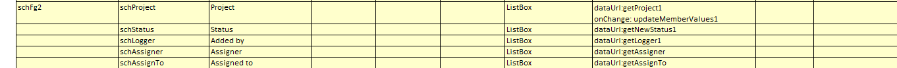
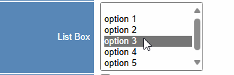

## Function

The listBox component setup is mostly the same as combobox, only the widget
needs to be changed to listBox. Example:

"dataUrl" is necessary, The dropdown box needs to get all the options selected
by the dropdown box by this method.

"values" is not necessary, the default value is "{value: 'value', display:
'display'}". Each option of the drop-down box has a display value and an
actual value, and this parameter is used to specify which property is the
actual value and which property is the display value of each option in the
obtained data.

"onchange" is not necessary, If this parameter is set, this method will be
triggered when combobox change options; all the data in the current page will
be passed to the backend, and then the method will decide whether to refresh
the specified table or refresh the whole page according to the parameters it
comes with, and the default is to refresh the whole page.

### Usage

Example:

## Implementation method

Same as combobox:

[Combo](Combo.md "Combo")

