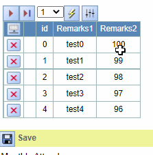
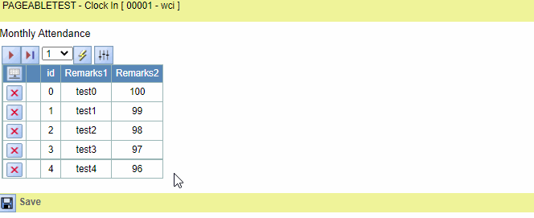
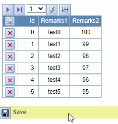

## Function

Add the ability to paginate a table.

Two modes are available: server-side paging and client-side paging. From the
user's perspective, the usage of these two modes is the same.

### Usage

If a form is pageable, six buttons will be displayed at the top left of the
form, from left to right to jump to the first page, the previous page, the
next page, jump to the last page, jump to the specified page, display all the
data of the form.

Here is an example about pageable table:

In server pageable, page flip if the previous page has changes and not
submitted then pop-up prompt, the second page flip abandoned to submit to the
corresponding page.

In client pageable, add row will jump to the last page, delete row will stay
on the original page.

## Implementation Method

### Front End

For server-side paging, pass the current page number and page size to the
backend, then display the data returned from the backend.

For client-side paging, display a portion of the entire table data based on
the page number.

#### Create function that jumps to a specified page

Server:

    
    
    const [pageNation, setPageNation] = React.useState(1)
    const [pageSelect, setPageSelect] = React.useState(1)
    const [totalPageNm, setTotalPageNm] = React.useState(0)
    const [messageFlag, setMessageFlag] = React.useState(true)
    
    const getPageDatawithServer = (pageNum: number | undefined) => {   
      let modifyFlag = 0 
      state.data.map((row) => {
        if (row[1].value !== "") {
          modifyFlag += 1
        }
      })
      if (modifyFlag !== 0 && messageFlag){
        showInfoMessage("There are unsaved changes on the current page, continuing to page will lose them");
        setMessageFlag(false)
        return
      } 
      setMessageFlag(true)
      clearMessage()    // If this page has changed, a prompt will appear when you turn the page
        
      if (pageNum !== undefined && pageNum!== 0) {
        setPageSelect(pageNum)
        setPageNation(pageNum)
      }
      // call api
      const data = {pageNum: pageNum, pageSize: pageSize}
      HttpPost(tableParams.dataUrl, JSON.stringify(data))
          .then((response) => response.json())
          .then((result) => {
            let data = getResponseData(result)
            if (data) {
              setTableData(tableUtil.parseTableData(data["pageData"], fields))
              setTotalPageNm(Math.ceil(data["totalLength"] / pageSize))
              setShowEnd(tableUtil.parseTableData(data["pageData"], fields).length)
              if (pluginList !== undefined) {
                setPluginParams(
                  tableUtil.getTablePluginParams(data, tableParams.pluginParams)
                )
              }
            }
          })
    }
    

Client:

    
    
    const [showStart, setShowStart] = React.useState(0)
    const [showEnd, setShowEnd] = React.useState(0)
    const getPageDatawithClient = (pageNum: number | undefined) => {
      if (pageNum !== undefined) {
        setPageSelect(pageNum)
        setPageNation(pageNum)
        const start = (pageNum - 1) * pageSize
        let end = 0
        if (pageNum === totalPageNm) {
          end = state.data.length
        } else {
          end = pageNum * pageSize
        }
        setShowStart(start)
        setShowEnd(end)
      }
    }
    

#### Create click events for each button

    
    
    const getTheFirstPage = () => {
      if (pageType === "server") {
        getPageDatawithServer(1)
      } else if (pageType === "client") {
        getPageDatawithClient(1)
      }
    }
    
    const getPreviousPage = () => {
      if (pageType === "server") {
        getPageDatawithServer(Number(pageNation) - 1)
      } else if (pageType === "client") {
        getPageDatawithClient(Number(pageNation) - 1)
      }
    }
    
    const getNextPage = () => {
      if (pageType === "server") {
        getPageDatawithServer(Number(pageNation) + 1)
      } else if (pageType === "client") {
        getPageDatawithClient(Number(pageNation) + 1)
      }
    }
    
    const getTheLastPage = () => {
      if (pageType === "server") {
        getPageDatawithServer(totalPageNm)
      } else if (pageType === "client") {
        getPageDatawithClient(totalPageNm)
      }
    }
    
    const setPageNum = (event: any) => {
      setPageSelect(event.target.value.trim())
    }
    
    const refreshPage = () => {
      if (pageType === "server") {
        getPageDatawithServer(Number(pageSelect))
      } else if (pageType === "client") {
        getPageDatawithClient(Number(pageSelect))
      }
    }
    
    const showAllData = () => {
      if (pageType === "client") {
        if (showStart === 0 && showEnd === state.data.length) {
          getPageDatawithClient(Number(pageNation))
        } else {
          setShowStart(0)
          setShowEnd(state.data.length)
        }
      } else if (pageType === "server") {
        if (state.data.length > pageSize) {
          getPageDatawithServer(Number(pageNation))
        } else {
          getPageDatawithServer(0)
        }
      }
    }
    

#### Create and show all buttons

    
    
    const pageNode = React.useMemo(() => {
      if (pageSize !== null && pageType !== null &&  pageSize > 0 ) {
        return (
          

            {pageNation === 1 ? null : (
              </img>
            )}
    
            {pageNation === 1 ? null : (
              </img>
            )}
    
            {pageNation === totalPageNm ? null : (
              </img>
            )}
    
            {pageNation === totalPageNm ? null : (
              </img>
            )}
            &nbsp;
    
            <select className="Pageimg" value={pageSelect} id="pageSelect" onChange={setPageNum}>
              {range(totalPageNm).map((pn) => (
                <option key={pn} value={pn + 1} onClick={() => setPageNum(pn + 1)}>
                  {pn + 1}
                </option>
              ))}
            </select>
            </img>
            &nbsp;
    
            </img>
          

        )
      }
    }, [pageNation, pageSelect, pageSize, totalPageNm, state.data, messageFlag, showStart, showEnd])
    
    const rootNode = React.useMemo(
      () => (
        <form className="div_a" id={name} name={name}>
          <label className="fieldgroup_caption">{caption}</label>
          {pageNode}
          ...
        </form>
      ),
      [
        ...
        pageNode,
      ]
    )
    

#### Display different data according to page type and page number

    
    
    const getShowRange = () => {
      if (pageType === "client" && state.data.length !== 0 && state.data.length >= showEnd) {
        return [showEnd, showStart]
      } else {
        return [size.rows, 0]
      }
    }  
    
    const tableNode = React.useMemo(
      () => (
        <Table columns={size.columns} hideColumnIndicators={hideColumnIndicators}>
          <HeaderRow>
            ...
          </HeaderRow>
          {range(getShowRange()[0], getShowRange()[1]).map((rowNumber) => (
            <Row>
              ...
            </Row>
          ))}
        </Table>
      ), [...])
    

#### Other

    
    
    React.useEffect(() => {
      if (pageSize === null || pageType === null || pageSize <=0 ) {
        return
      } 
      if (pageType === "client") {
        const start = (pageNation - 1) * pageSize
        const end = pageNation * pageSize
        setShowStart(start)
        setShowEnd(end)
      }
      setPageSelect(pageNation)
    }, [tableParams])   // triggered when table change, if pageType is client, we need the new table show the same page.
    
    React.useEffect(() => {
      if (pageSize === null || pageType === null || pageSize <=0 ) {
        return
      } 
      refreshPage()
    }, [])  // triggered when the table is displayed for the first time, show the first page.
    
    React.useEffect(() => {
      if (pageType === "client" ) {
        setTotalPageNm(Math.ceil(state.data.length / pageSize))
      } 
    }, [state.data.length])  // triggered when a new row is added to the list, count the new total page number.
    

### Back End

Add a function on the back end for server-side paging that passes different
data to the front end based on the number of pages.

    
    
    class PAGEABLETEST(PyiAuthAPIView):
        pageNm = 1
    
        def getScreenFgNm(self, request):
            PAGEABLETEST.pageNm = 1  
            # initial pageNm when refresh page 
            screen = getScreenDfnJson(request, getScreenName(self), getShortUrl(self))
            return PyiSccJsonResponse(data=screen)
    
        def post(self, request, *args, **kwargs):
            action = kwargs.get('action')
            ...
            elif action == self.dataSetName is not None and action == ('get' + self.dataSetName[0].upper() + self.dataSetName[1:]):
                return self.getDatabyPageNm(request)
            ...
    
        def getDatebyPageNm(self, request):
            requestData = pyihttp.GetRequestData(request)
            pageSize = int(requestData["pageSize"])
            pageNum = int(requestData["pageNum"])
            PAGEABLETEST.pageNm = pageNum
    
            start = (pageNum-1)*pageSize
            end = pageNum*pageSize
            rcs = pageabletest.objects.all().order_by("id")  
            # Find different data from the database according to requirements  
            if pageNum == 0:
                return PyiSccJsonResponse(data={"pageData": rcs, "totalLength": len(rcs)})
            else: 
                return PyiSccJsonResponse(data={"pageData": rcs[start:end], "totalLength": len(rcs)})
    

