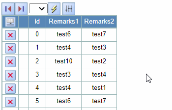

## Function

When the mouse moves to the head of the table or the last column to display
the icon, click on the icon page to scroll to the bottom or top of the table.

Here is a example:

## Implementation method

First create icons in the column header and the right side of the last row of
the table.

    
    
    const topIconNode = React.useMemo(
      () => 
      

        

          {state.showRange.length !== 0 && showTopIcon ? (
              </img>
            ) : null}
        

        ...
      

      , [state.showRange, showTopIcon]
    )
    
    const bottomIconNode = React.useMemo(
      () => 
      

        

          {state.showRange.length !== 0 && showBottomIcon ? (
            </img>
          ) : null}
        

      

      , [state.showRange, showBottomIcon]
    )
    
    const rootNode = React.useMemo(
      () => (
        <form className="div_a" id={name} name={name}>
          {pageNode}
          

            ...
            {topIconNode}
            {bottomIconNode}
          

        </form>
      ),
      [
        ...
        topIconNode,
        bottomIconNode,
      ]
    )
    

Show icon when the mouse moves to the right side of the column headers or the
last row.

    
    
    const [showTopIcon, setShowTopIcon] = React.useState(false)   // 控制headerRow右侧的图标是否显示
    const [showBottomIcon, setShowBottomIcon] = React.useState(false)   // 控制lastRow右侧的图标是否显示
    
    let timeOutFunc1 = null
    let timeOutFunc2 = null
    const showHeaderRowIcon = () => {
      clearTimeout(timeOutFunc1)
      setShowTopIcon(true)
    }
    const showLastRowIcon = () => {
      clearTimeout(timeOutFunc2)
      setShowBottomIcon(true)
    }
    const hideHeaderRowIcon = () => {
      timeOutFunc1 = setTimeout(function () {
        setShowTopIcon(false)
      }, 2000)
    }
    const hideLastRowIcon = () => {
      timeOutFunc2 = setTimeout(function () {
        setShowBottomIcon(false)
      }, 2000)
    }
    
    React.useEffect(() => {
      const headerRow = document.getElementById("row_-2 " + name)
      const lastRowNm = state.showRange.slice(-1)[0]
      const lastRow = document.getElementById('row_' + lastRowNm + ' ' + name)
      if (headerRow && lastRow) {
        headerRow.addEventListener('mouseenter', showHeaderRowIcon)
        lastRow.addEventListener('mouseenter', showLastRowIcon)
        headerRow.addEventListener("mouseleave", hideHeaderRowIcon)
        lastRow.addEventListener("mouseleave", hideLastRowIcon)
    
        return () => {
          headerRow.removeEventListener("mouseenter", showHeaderRowIcon)
          lastRow.removeEventListener("mouseenter", showLastRowIcon)
          headerRow.removeEventListener("mouseleave", hideHeaderRowIcon)
          lastRow.removeEventListener("mouseleave", hideLastRowIcon)
        }
      }
    }, [state.showRange])  // 鼠标移动到列头或最后一行的时候显示图标
    

Create click fuction

    
    
    const goToBottom = () => {
      const lastRowNm = state.showRange.slice(-1)[0]
      const lastRow = document.getElementById('row_' + lastRowNm + ' ' + name)
      if (lastRow) {
        lastRow.scrollIntoView({block : 'center'})
      }
    }
    const goToTop = () => {
      const headerRow = document.getElementById("row_-2 " + name)
      if (headerRow) {
        headerRow.scrollIntoView({block : 'center'})
      }
    }
    

