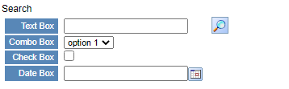
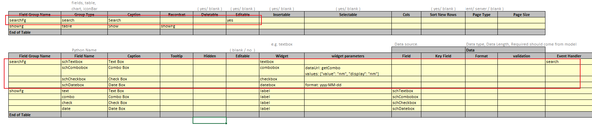

## Function

A form with multiple input boxes and a search button. Clicking the search
button passes the content of the input box to the backend, which refreshes the
entire page or refreshes the specified table according to the set parameters.

There are four input boxes in SearchFg: textbox, combobox, checkbox and
datebox.

textbox: text input; combobox: choose option; checkbox: choose true or false;
datebox: select date.

Example:

## Pre-processing

Set Field Group Name and Group Type of searchFg component in excel. Set Group
Type to 'search'

  
Add a function named "search" in the backend to retrieve search content. This
function can accept parameters, such as "search(showFg)".

If no parameters are provided, the search will refresh the entire page.

The search function does not need to return content. Instead, it should save
the search content. Then, use the search content to generate and return the
new table content in the "getShowFg" function.

    
    
    def search(self):
        requestData = self.getRequestData()
        schItems = requestData.get('searchFg')
        self.saveSession({'schItems': schItems})
        return PyiSccJsonResponse()
    
    def getShowFg(self):
        schItems = self.getSessionParameter('schItems')
        data = [schItems] if schItems else []
        return PyiSccJsonResponse(data=data)
    

And if there are parameters, it will only refresh the table corresponding to
the parameters.

The search function needs to return the name of the table and the new data
after this table search.

    
    
    def search(self):
        requestData = self.getRequestData()
        schItems = requestData.get('searchFg')
        return self._returnQueryResult('showFg', schItems)
    

