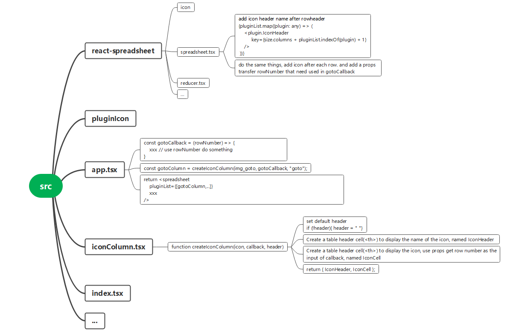

## A function for creating the plugin is needed first

    
    
    export function createIconColumn(icon: any, myCallback: any, header?: string) {
      if (!header){
        header = " "
      }
      const IconHeader = () => (
        <th className="Spreadsheet__header Spreadsheet__header__column">
          {header}
        </th>
      );
      const IconCell = (props: any) => (
        <th  className="img">
          {
            // eslint-disable-next-line jsx-a11y/alt-text
             myCallback(props.rowNumber)}
              style={{ cursor: "pointer" }}
            />
          }
        </th>
      );
      return { IconHeader, IconCell };
    }
    

## Then feel the need to create any plug-in

    
    
    const expandCallback = (rowNumber: number) => {
      //do something with rowNumber
    };
    const expandColumn = createIconColumn(img_expand, expandCallback, "expand");
    const approveCallback = (rowNumber: number) => {
      //do something with rowNumber
    };
    const approveColumn = createIconColumn(img_approve,approveCallback,"approve");
    xxx  //other plugins
    

## Pass the list of plugins as prop to the spreadsheet component

    
    
     return (
          <Spreadsheet
            pluginList={[expandColumn, approveColumn]} 
            data={data}
            xxx //other props
          />
    

## Finally, according list of plugins render the corresponding columns inside
the component

add icon header name after rowheader

    
    
    {pluginList.map((plugin: any) => (
        <plugin.IconHeader
             key={size.columns + pluginList.indexOf(plugin) + 1}
        />
    ))}
    

add icon after each row. and add a props transfer rowNumber that need used in
gotoCallback:

    
    
    {pluginList.map((plugin: any) => (
        <plugin.IconCell
            key={size.columns + pluginList.indexOf(plugin) + 1}
            rowNumber={rowNumber}
        />
    ))}
    

## Mindmap:

add plugin

