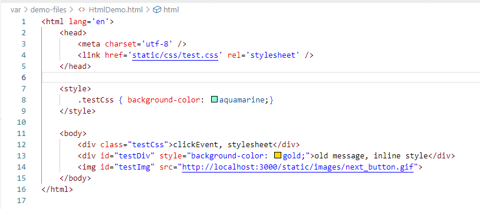
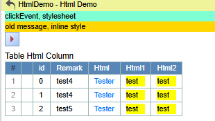

## Function

Accept html files passed directly from the backend in the front end and
display them.

Example file:

Displayed Html:

## Implementation method

Create a component that receives the dataUrl of the html file, gets the html
file according to the dataUrl, and displays this static Html file on the web
page.

    
    
    interface StaticHtml {
      params: any
    }
    
    const StaticHtml: React.FC<StaticHtml> = (props) => {
      const caption = props.params.caption
      const dataUrl = props.params.dataUrl
      const name = props.params.name
    
      const [htmlData, setHtmlData] = React.useState("")
    
      React.useEffect(() => {
        if (dataUrl) {
          HttpGet(dataUrl)
            .then((response) => response.json())
            .then((result) => {
              if (validateResponse(result, false)) {
                setHtmlData(result.data)
              }
            })
        }
      }, [dataUrl])
    
      const handleWindowResize = () => {
        const ifm = document.getElementById(name) as any
        const height = ifm.contentWindow.document.body.scrollHeight + 16
        ifm.style.height = height + "px"
        ifm.scrolling = "no"
      }
    
      useEffect(() => {
        handleWindowResize()
        window.addEventListener("resize", handleWindowResize)
        return () => {
          window.removeEventListener("resize", handleWindowResize)
        }
      }, [handleWindowResize])
    
      return (
        <>
          <iframe
            id={name}
            onLoad={handleWindowResize}
            style={{ width: "100%", border: "none", overflow: "auto" }}
            title={caption}
            srcDoc={htmlData}
          ></iframe>
        </>
      )
    }
    
    export default StaticHtml
    

