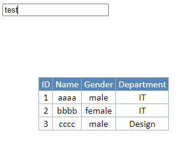
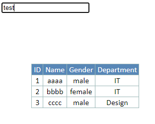
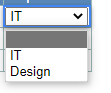
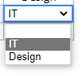

### Blue Rectangle

#### Problem Description

When selecting a cell in the RSS, a blue rectangle should appear. However,
when using the keyboard to move the selected cell, sometimes the blue
rectangle becomes black.

#### Solution

Add the following lines in Spreadsheet.css

    
    
    *:focus{
      outline: none;
    }
    

#### The Input Outside The Spreadsheet

If modify the Spreadsheet.css like above, when the input outside the
spreadsheet gets focus, there is no black box.

If remove that part, when it gets focus, there is a black box surrounding the
input.

### Combo Box Border

The select style needs to be set like this; otherwise, there will be a thin
black line inside the blue rectangle, as shown in the first image. If set like
below, it will look like the second image.

    
    
    <select style={{border: "none"}}>
    

### Icon Alignment

#### Remove the white border from the bottom of the image

Add a new style to the .css file, its effect is to turn all images into a
block element

    
    
    img{
      display: block;
    }
    

If the above method doesn't work, try the other methods in this
page：<https://blog.csdn.net/SubStar/article/details/103761808>

#### Center align of block elements

    
    
    img{
      display: block;
      margin: auto;
    }
    

If the above method doesn't work, try the other methods in this
page：<https://blog.csdn.net/zhang_yu_ling/article/details/90272623>

Here is the final result：

