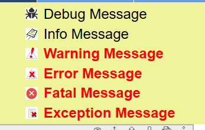

## Function

Display messages contained in content returned by the backend on the frontend.

Example:

## Implementation Method

Put different icons in front of the message according to the different message
levels and then display them.

    
    
    const pyiGlobal = pyiLocalStorage.globalParams
    const debugIcon = pyiGlobal.PUBLIC_URL + "images/debug_icon.png"
    const infoIcon = pyiGlobal.PUBLIC_URL + "images/info_icon.gif"
    const warningIcon = pyiGlobal.PUBLIC_URL + "images/warning_icon.gif"
    const errorIcon = pyiGlobal.PUBLIC_URL + "images/error_icon.gif"
    const fatalIcon = pyiGlobal.PUBLIC_URL + "images/fatal_icon.png"
    const exceptionIcon = pyiGlobal.PUBLIC_URL + "images/exception_icon.gif"
    
    interface ISysMsgBox {
      ref: any
      label: string
      value: string
      name: string
      editable: boolean
      onBlur?: FocusEventHandler<HTMLInputElement>
    }
    const SysMsgBox: React.FC<ISysMsgBox> = forwardRef((props, ref: Ref<any>) => {
      const negativeMessages = ['error', 'exception', 'warning', 'fatal']
      return (
        

          {props.label.toLowerCase() === "debug" ? (
            
          ) : props.label.toLowerCase() === "info" ? (
            
          ) : props.label.toLowerCase() === "warning" ? (
            
          ) : props.label.toLowerCase() === "error" ? (
            
          ) : props.label.toLowerCase() === "fatal" ? (
            
          ) : props.label.toLowerCase() === "exception" ? (
            
          ) : (
            
          )}
    
          

            {props.value}
          

        

      )
    })
    export default SysMsgBox
    

