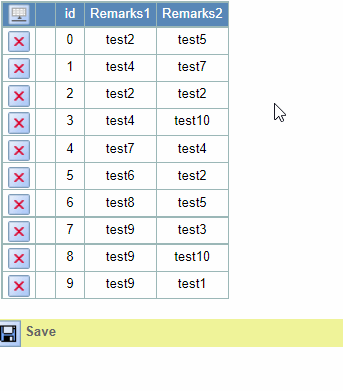
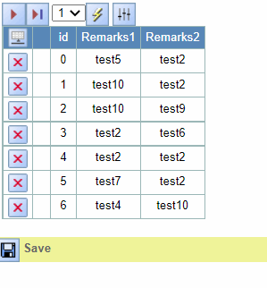

## Function

Add the function of filtering data in the table.

When the mouse moves to the column header, an icon titled Filter will be
displayed, click it to show the filter row, and the table will filter the data
according to the input in this row.

### Usage

Here is a simple example of the use of the filter function:

The two buttons on the right of the filter row are to hide the filter line and
initialize the filter row.

If the form is paged will only filter the selected page, Clear the search
field when using button Select or button ShowAll.

## Implementation Method

### Create an icon node

The first icon shows the filter row, the second icon downloads the table data,
the third icon hides the filter row, and the fourth icon initializes the
filter row。

The first two icons are displayed when the mouse moves to the column header,
and the last two icons are displayed when the filter row is displayed.
TableFg.tsx:

    
    
    const [filterRow, setFilterRow] = React.useState(false)
    const showFilterRow = () => {
      setFilterRow(true)
    }
    const hideFilterRow = () => {
      setFilterRow(false)
      if (pageType === pyiGlobal.CLIENT_PAGING) {
        setShowRange(preShowRange) // 隐藏搜索栏的时候显示上一个未经过滤showRange
      } else {
        setShowRange(range(state.data.length, 0)) // 隐藏搜索栏的时候显示所有data
      }
    }
    const resetFilterRow = () => { // 重置搜索栏
      if (pageType === pyiGlobal.CLIENT_PAGING) {
        setShowRange(preShowRange)
      } else {
        setShowRange(range(state.data.length, 0))
      }
      const inputs = document.getElementsByClassName("filter_input")
      range(size.columns - 2).map((column: number) => {
        if (inputs[column]) {
          (inputs[column] as HTMLInputElement).value = ''
        } 
      })
    }
    
    const headerColumnIconNode = React.useMemo(
      () => 
      

        

          {state.filterIcon ? (
              </img>
            ) : null}
          {state.exportCSV ? (
            <CSVLink
              headers={getCSVFile().header}
              data={getCSVFile().data}
              filename={getCSVFile().filename}
            >
              {</img>}
            </CSVLink>
            ) : null
          }
        

        

          {filterRow ? (
            </img>
          ) : null}
          {filterRow ? (
            </img>
          ) : null}
        

      

      , [state.exportCSV, state.filterIcon, filterRow, state.data.length, preShowRange]
    )
    
    const rootNode = React.useMemo(
      () => (
        <form>
          

            ...
            {headerColumnIconNode}
            ...
          

        </form>
      ), [..., headerColumnIconNode])
    

### Create a filter row

Main part:

    
    
    {filterRow ? (
      <Row key={-1} row={-1}>
        {range(size.columns).map((columnNumber) =>
          columnNumber === 0 && (insertable || deletable) ? (
            <th className='Spreadsheet__cell-filter' />
          ) : columnNumber === 1 && (editable || insertable || deletable) ? (
            <th className='Spreadsheet__cell-filter' />
          ) : columnNumber > 1 ? (
            <td className="Spreadsheet__cell-filter">
              <input
                id="filter_input"
                className="filter_input"
                style={{width: inputWidth[columnNumber - 2] ? inputWidth[columnNumber - 2] + "px" : null}}
                ref={filterRefs[columnNumber - 2]}
                onClick={() =>
                  activateInput({ row: -1, column: columnNumber })
                }
                onChange={() => setNewShowRange(preShowRange)}
                value={filterRefs[columnNumber - 2].current?.value ? filterRefs[columnNumber - 2].current?.value : ""}
              />                  
            </td>
          ) : null
        )}
      </Row>
    ) : null}
    

Input box width:

    
    
    const [inputWidth, setInputWidth] = React.useState([])
    React.useEffect(() => {
      const inputWidth = []
      const headers = document.getElementsByClassName("Spreadsheet__header__column")
      range(headers.length).map((column: number) => {
        const width = (headers[column] as HTMLInputElement).offsetWidth
        inputWidth.push(width - 3)
      })
      setInputWidth(inputWidth.slice(2 - size.columns)) // 获取列头各个单元格的宽度，用来设置input框的宽度
    }, [state.data])
    

Filter function:

    
    
    let filterRefs: { [key: string]: React.MutableRefObject<HTMLInputElement> } = {}
    const _useRef =  React.useRef
    range(size.columns - 2).map((column: number) => {
      filterRefs[column] = _useRef(null)
    })
    
    const filterData = () => { //  过滤当前页
      let preShowRange = []
      if (pageType === pyiGlobal.CLIENT_PAGING) {
        if (pageNation === totalPageNm) {
          preShowRange = range(state.data.length, (pageNation - 1) * pageSize)
        } else {
          preShowRange = range(pageNation * pageSize, (pageNation - 1) * pageSize)
        }
      } else {
        preShowRange = range(state.data.length, 0)
      }
      setNewShowRange(preShowRange)
    } 
    
    const setNewShowRange = (showRange: number[]) => { // 过滤指定的showRange
      if (state.data.length <= showRange.slice(-1)[0]) {
        return
      }
      let preShowRange = showRange
      let newShowRange = []
      range(size.columns - 2).map((column: number) => {
        const search = filterRefs[column].current?.value.toLowerCase()
        preShowRange.map((rowNumber: number) => {
          let cell = state.data[rowNumber][column + 2]
          let data: string
          if (!cell.value) {
            data = ''
          } else {
            data = cell.value.toLowerCase()
          }
          if (data.indexOf(search) !== -1) {
            newShowRange.push(rowNumber)
          }
        })
        preShowRange = newShowRange
        newShowRange = []
      })
      setShowRange(preShowRange)
    }
    

Refiltering:

    
    
    React.useEffect(() => {
      if (!filterRow) {
        return
      }
      if (pageType === pyiGlobal.SERVER_PAGING) {
        filterData()
      } else {
        setNewShowRange(preShowRange)
      }
    }, [pageNation]) // 翻页的时候重新过滤
    

