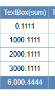

## Function

Added table footer rows to the table where the user can display the sum,
average, maximum, minimum or custom output for a column.

### Usage

#### Header

A maximum of three levels of headers are allowed. If the 'Header Level 3'
columns are all empty, only two levels of headers will be set up.

Every cell with a value is merged right down to the blank cells.

#### Footer

First of all, add "formula: xxx, format: xxx, dataType: xxx" to the "footer"
column in Excel. If the table footer column is not set in Excel, the table
footer will not be displayed.

In this setup, format and dataType are optional.

The self-contained formulas are as follows: sum, avg, max, min. Users can also
pass in custom functions in the formula.

If format is not present, the results obtained by 'formula' will be displayed
directly without further processing. If format is set like '0.0' or '0.000',
it means retaining one or three decimal places; if format is set like
'HH:mm:ss', it means formatting the date in this format.

If dataType is not present, the default dataType is 'float'. The currently
supported formats are int/float/date/time/datetime.

### Example

#### Header

Example:

#### Footer

Setting: footer: {'formula': 'max', 'dataType': 'float'}

Setting: footer: {'formula': 'sum', 'format': '0.0000', 'dataType': 'float'}

Setting: footer: {'formula': 'avg', 'format': '0.0'}

Setting: footer: {'formula': 'min', 'format': 'YYYY-MM-DD', 'dataType':
'time'}

Setting: footer: {'formula': 'avg', 'format': 'HH:mm:ss', 'dataType': 'time'}

Setting: footer: {'formula': 'sum', 'format': 'HH:mm:ss', 'dataType': 'time'}

Setting: footer: {'formula': "function (columnData){let res = ' ';
columnData.map((data) => {res += data.slice(-1)}); return res}", 'colSpan':
'2', 'style': 'text-align: right'}

## Implementation Method

### Header

Parse the table header settings in TableUtil.tsx:

    
    
    export function getTableBodyStylePrams(tableName: string, tableFields: any, tableData, tableStyle) {
      if (tableData.length === 0) {
        return []
      }
    
      const dataLength = tableData.length
      const fieldLength = tableFields ? tableFields.length : 0
      let tableBodyStylePrams = []
      if (tableStyle) {
        if (tableStyle.length === 1 && Object.keys(tableStyle[0]).length === 1 && Object.keys(tableStyle[0])[0].toLocaleLowerCase() === "style") {
          // If there is only one dictionary in the style list, and that dictionary has only one key, 'style', it means that the style is applied to the whole form.
          tableBodyStylePrams = Array(dataLength).fill(Array(fieldLength).fill(tableStyle[0]["style"]))
        } else {
          for (var i = 0; i < dataLength; i++) {
            tableBodyStylePrams.push(Array(fieldLength).fill(null))
          }
          tableStyle.map((style) => {
            // index for -2: modify the style of a whole row or column; index for -1: to find the row/column, do not deal with; other cases index is to modify the coordinates of the cell
            let rowIndex = -2
            let colIndex = -2
            if (style["row"] !== undefined) {
              rowIndex = -1
              tableData.map((rowData, index) => {
                if (String(rowData["id"]) === String(style["row"])) {
                  rowIndex = index
                }
              })
            }
            if (style["col"] !== undefined) {
              colIndex = -1
              tableFields.map((field, index) => {
                if (field.dataField === style["col"]) {
                  colIndex = index
                }
              })
            }
    
            if (rowIndex === -2 && colIndex >= 0) {
              tableBodyStylePrams.map((rowStyle) => {
                rowStyle[colIndex] = { ...rowStyle[colIndex], ...style["style"] }
                if (style.class) {
                  const classStyle = { class: style.class }
                  rowStyle[colIndex] = { ...rowStyle[colIndex], ...classStyle }
                }
              })
            } else if (colIndex === -2 && rowIndex >= 0) {
              for (var i = 0; i < fieldLength; i++) {
                tableBodyStylePrams[rowIndex][i] = { ...tableBodyStylePrams[rowIndex][i], ...style["style"] }
                if (style.class) {
                  const classStyle = { class: style.class }
                  tableBodyStylePrams[rowIndex][i] = { ...tableBodyStylePrams[rowIndex][i], ...classStyle }
                }
              }
            } else if (colIndex >= 0 && rowIndex >= 0) {
              tableBodyStylePrams[rowIndex][colIndex] = { ...tableBodyStylePrams[rowIndex][colIndex], ...style["style"] }
              if (style.class) {
                const classStyle = { class: style.class }
                tableBodyStylePrams[rowIndex][colIndex] = { ...tableBodyStylePrams[rowIndex][colIndex], ...classStyle }
              }
            } else {
              let info = "Style setting failure! Table name: " + tableName
              if (rowIndex >= -1) {
                info += ", rowID: " + style["row"]
              }
              if (colIndex >= -1) {
                info += ", columnFieldName: " + style["col"]
              }
              info += ", style: " + JSON.stringify(style["style"])
              console.log(info)
            }
          })
        }
      }
    
      if (tableFields) {
        for (let index = 0; index < fieldLength; index++) {
          const field = tableFields[index]
          if (Object.keys(field.style).length > 0) {
            tableBodyStylePrams.map((rowStyle) => {
              rowStyle[index] = { ...rowStyle[index], ...field.style }
            })
          }
        }
      }
      // console.log("tableBodyStylePrams", tableBodyStylePrams);
      return tableBodyStylePrams
    }
    

Show headerat the start of the table if there is a footer.

    
    
    {/* HeaderRow */}
    {headerPrams.headerLines.map((rowNumber) => (
      <HeaderRow id={"row_-" + rowNumber + " " + name}>
        {showRowNo && rowNumber === 2 ? (
          <ColumnIndicator
            key={-rowNumber}
            row={-rowNumber}
            column={-1}
            tableName={name}
            stylePrams={{ rowSpan: headerPrams.headerLines.length }}
            label={"#"}
          />
        ) : null}
        {type === TABLE
          ? range(size.columns).map((columnNumber) =>
              rowNumber === 2 && columnNumber === 0 && (insertable || deletable) ? (
                <ColumnIndicator
                  tableName={name}
                  key={columnNumber}
                  row={-rowNumber}
                  column={columnNumber}
                  stylePrams={{ rowSpan: headerPrams.headerLines.length }}
                  label={insertable ? </img> : null}
                />
              ) : rowNumber === 2 && columnNumber === 1 && (editable || insertable || deletable) ? (
                <ColumnIndicator
                  tableName={name}
                  key={columnNumber}
                  row={-rowNumber}
                  column={columnNumber}
                  stylePrams={{ rowSpan: headerPrams.headerLines.length }}
                  label={""}
                />
              ) : columnNumber > 1 && state.headerLabels ? (
                inVisibleCols && inVisibleCols.indexOf(columnNumber) !== -1 ? null : (
                  <ColumnIndicator
                    tableName={name}
                    key={columnNumber}
                    row={-rowNumber}
                    column={columnNumber}
                    columnStatus={state.columnStatus[columnNumber]} // XH 2022-07-04 column sort
                    stylePrams={theadStylePrams[columnNumber - 2][rowNumber - 2]}
                    label={columnNumber in state.headerLabels ? state.headerLabels[columnNumber] : null}
                    tip={columnNumber in state.headerLabelTips ? state.headerLabelTips[columnNumber] : null} // YL, 2023-05-06 add tooltip
                  />
                )
              ) : null
            )
          : range(size.columns).map((columnNumber) =>
              rowNumber === 2 && columnNumber === 1 && selectable ? (
                <ColumnIndicator
                  tableName={name}
                  key={columnNumber}
                  row={-rowNumber}
                  column={columnNumber}
                  label={
                    </img>
                  }
                />
              ) : columnNumber > 1 && state.headerLabels ? (
                inVisibleCols && inVisibleCols.indexOf(columnNumber) !== -1 ? null : (
                  <ColumnIndicator
                    tableName={name}
                    key={columnNumber}
                    row={-rowNumber}
                    column={columnNumber}
                    columnStatus={state.columnStatus[columnNumber]} // XH 2022-07-04 column sort
                    stylePrams={theadStylePrams[columnNumber - 2][rowNumber - 2]}
                    label={columnNumber in state.headerLabels ? state.headerLabels[columnNumber] : null}
                    tip={columnNumber in state.headerLabelTips ? state.headerLabelTips[columnNumber] : null} // YL, 2023-05-06 add tooltip
                  />
                )
              ) : null
            )}
        {rowNumber === 2
          ? pluginList &&
            pluginList.map((plugin: any, index: number) => (
              <plugin.IconHeader
                key={size.columns + pluginList.indexOf(plugin) + 1}
                position={"cell_-2_" + (size.columns + index - 2) + " " + name}
                rowSpan={headerPrams.headerLines.length}
              />
            ))
          : null}
        {rowNumber === 2 && scrollMode ? (
          <th
            id={"cell_-2_" + (size.columns + (pluginList ? pluginList.length : 0) - 2) + " " + name}
            key={size.columns + (pluginList ? pluginList.length : 0) - 2}
            className="Spreadsheet__header Spreadsheet__header__column"
            style={{ width: scrollWidth + "px", color: "#F5FF00", cursor: "pointer" }}
            onClick={exitScrollingMode}
            rowSpan={headerPrams.headerLines.length}
          >
            X
          </th>
        ) : null}
      </HeaderRow>
    ))}
    

### Footer

Parse the table footer settings in TableUtil.tsx:

    
    
    export function getTableFootStylePrams(table: any) {
      const tableFootStylePrams = []
      let colSpan = 0
      if (table.fields) {
        for (let index = 0; index < table.fields.length; index++) {
          let footer = table.fields[index].footer
          let pram = { colSpan: null, style: null }
          if (footer) {
            if (footer.colSpan && colSpan <= 1) {
              colSpan = Number(footer.colSpan)
              pram.colSpan = colSpan
            } else if (colSpan > 1) {
              colSpan -= 1
              pram.colSpan = 0
            }
    
            let style = []
            if (footer.style && typeof footer.style === "string") {
              footer.style = parsePrams(footer.style)
            }
            if (footer.style && typeof footer.style === "object") {
              const properties = Object.keys(footer.style)
              properties.map((property) => {
                style.push([property, footer.style[property]])
              })
            }
            pram.style = style
          } else if (colSpan > 1) {
            colSpan -= 1
            pram.colSpan = 0
          }
          tableFootStylePrams.push(pram)
        }
      }
      // console.log("tableFootStylePrams", tableFootStylePrams);
      return tableFootStylePrams
    }
    
    export function getTableFooterPrams(table: any) {
      const tableFooterPrams = {}
      if (table.fields) {
        for (let index = 0; index < table.fields.length; index++) {
          let footer = table.fields[index].footer
          if (footer) {
            tableFooterPrams[index] = footer
          }
        }
      }
      // console.log("tableFooterPrams", tableFooterPrams);
      return tableFooterPrams
    }
    

Show footer at the end of the table if there is a footer.

    
    
    {/* FooterRow */}
    {JSON.stringify(footerPrams) !== '{}' ? (
      <FooterRow id={"row_" + state.data.length + " " + name}>
        {showRowNo ? <ColumnIndicator key={state.data.length} row={state.data.length} column={-1} tablename={name} label={null} /> : null}
        {type === TABLE
          ? range(size.columns).map((columnNumber) =>
              columnNumber === 0 && (insertable || deletable) ? (
                <ColumnIndicator tablename={name} key={columnNumber} row={state.data.length} column={columnNumber} label={""} />
              ) : columnNumber === 1 && (editable || insertable || deletable) ? (
                <ColumnIndicator tablename={name} key={columnNumber} row={state.data.length} column={columnNumber} label={""} />
              ) : columnNumber > 1 ? (
                inVisibleCols && inVisibleCols.indexOf(columnNumber) !== -1 ? null : (
                  <ColumnIndicator
                    tablename={name}
                    key={columnNumber}
                    row={state.data.length}
                    column={columnNumber}
                    footStylePrams={tfootStylePrams[columnNumber - 2]}
                    label={getFooterData(footerPrams[columnNumber - 2], columnNumber, state.data, state.showRange)}
                  />
                )
              ) : null
            )
          : range(size.columns).map((columnNumber) =>
            columnNumber === 1 && selectable ? (
              <RowIndicator tablename={name} key={columnNumber} row={state.data.length} column={columnNumber} label={""} />
            ) : columnNumber > 1 ? (
              inVisibleCols && inVisibleCols.indexOf(columnNumber) !== -1 ? null : (
                <ColumnIndicator
                  tablename={name}
                  key={columnNumber}
                  row={state.data.length}
                  column={columnNumber[columnNumber - 2]}
                  footStylePrams={tfootStylePrams}
                  label={getFooterData(footerPrams[columnNumber - 2], columnNumber, state.data, state.showRange)}
                />
              )
            ) : null
          )}
        {pluginList &&
          pluginList.map((plugin: any, index: number) => (
            <th
              id={"cell_" + state.data.length + "_" + (size.columns + index - 2) + " " + name}
              key={size.columns + pluginList.indexOf(plugin) + 1}
              className="Spreadsheet__header Spreadsheet__header__column"
            />
          ))}
        {scrollMode ? (
          <th
            id={"cell_" + state.data.length + "_" + (size.columns + (pluginList ? pluginList.length : 0) - 2) + " " + name}
            key={size.columns + (pluginList ? pluginList.length : 0) - 2}
            className="Spreadsheet__header Spreadsheet__header__column"
            style={{ width: scrollWidth + "px", color: "#F5FF00", cursor:"pointer" }}
          />
        ) : null}
      </FooterRow>
    

Get the appropriate content to display in the footer according to the settings
in excel.

    
    
    export const getFooterData = (footerPram, columnNumber, tableData, showRange) => {
      if (!footerPram || tableData.length === 0 || showRange.length === 0) {
        return ''
      }
    
      let formula = footerPram.formula ? footerPram.formula.trim().toLocaleLowerCase() : ''
      let format = footerPram.format ? footerPram.format.trim() : ""
      let dataType = footerPram.dataType ? footerPram.dataType.trim().toLocaleLowerCase() : 'float'
      if (!formula) {
        return ''
      }
      let columnDataList = []
      tableData.map((row, index) => {
        if (showRange.indexOf(index) !== -1) {
          columnDataList.push(row[columnNumber].value)
        }
      })
    
      let res
      if (formula === "sum") {
        if (dataType === "int" || dataType === "float") 
        {
          columnDataList.map((data) => {
            res ? res += Number(data) : res = Number(data)
          })
        } else if ((dataType === "date" || dataType === "time" || dataType === "datetime") && format === "HH:mm:ss") {
          const resList = columnDataList[0].split(":")
          columnDataList.map((data, index) => {
            if (index === 0) {
              resList[0] = Number(resList[0])
              resList[1] = Number(resList[1])
              resList[2] = Number(resList[2])
            } else {
              const dataList = data.split(":")
              resList[0] += Number(dataList[0])
              resList[1] += Number(dataList[1])
              resList[2] += Number(dataList[2])
            }
          })
          let addMin, addHour = 0
          if (resList[2] >= 60) {
            addMin = Math.floor(resList[2] / 60)
            resList[2] = resList[2] % 60
          }
          if (resList[1] + addMin >= 60) {
            addHour = Math.floor(resList[1] / 60)
            resList[1] = (resList[1] + addMin) % 60
          }
          resList[0] += addHour
          res = String(resList[0]) + ":" + String(resList[1]) + ":" + String(resList[2])
          format = ''
        }
      } else if (formula === "avg") {
        if (dataType === "int" || dataType === "float") {
          columnDataList.map((data) => {
            res ? res += Number(data)/columnDataList.length : res = Number(data)
          })
        } else if ((dataType === "date" || dataType === "time" || dataType === "datetime") && format === "HH:mm:ss") {
          const resList = columnDataList[0].split(":")
          columnDataList.map((data, index) => {
            if (index === 0) {
              resList[0] = Number(resList[0])/columnDataList.length
              resList[1] = Number(resList[1])/columnDataList.length
              resList[2] = Number(resList[2])/columnDataList.length
            } else {
              const dataList = data.split(":")
              resList[0] += Number(dataList[0])/columnDataList.length
              resList[1] += Number(dataList[1])/columnDataList.length
              resList[2] += Number(dataList[2])/columnDataList.length
            }
          })
          res = String(resList[0].toFixed(0)) + ":" + String(resList[1].toFixed(0)) + ":" + String(resList[2].toFixed(0))
          format = ''
        }
      } else if (formula === "max") {
        if (dataType === "int" || dataType === "float") {
          res = Number(columnDataList[0])
          columnDataList.map((data) => {
            if (res < Number(data)) {
              res = Number(data)
            }
          })
        } else if (dataType === "date" || dataType === "time" || dataType === "datetime") {
          res = columnDataList[0]
          columnDataList.map((data) => {
            if (moment(res).isBefore(data)) {
              res = data
            }
          })
        }
      } else if (formula === "min") {
        if (dataType === "int" || dataType === "float") {
          res = Number(columnDataList[0])
          columnDataList.map((data) => {
            if (res > Number(data)) {
              res = Number(data)
            }
          })
        } else if (dataType === "date" || dataType === "time" || dataType === "datetime") {
          res = columnDataList[0]
          columnDataList.map((data) => {
            if (moment(res).isAfter(data)) {
              res = data
            }
          })
        }
      } else if (formula.startsWith("function")) {
        const pramsIndexLeft = formula.indexOf("(")
        const pramsIndexRight = formula.indexOf(")")
        const funcIndexLeft = formula.indexOf("{")
        const funcIndexRight = formula.lastIndexOf("}")
        const prams = formula.slice(pramsIndexLeft + 1, pramsIndexRight).split(",")
        const func = formula.slice(funcIndexLeft + 1, funcIndexRight)
        
        const __formula = new Function(prams[0].trim(), func)
        res = __formula(columnDataList)
      }
    
      if (res && dataType && format) {
        if (dataType === "date" || dataType === "time" || dataType === "datetime") {
          res = moment(res).format(format)
        } else {
          const index = format.indexOf(".")
          if (index !== -1) {
            const digits = format.slice(index + 1).length
            res = res.toFixed(Number(digits))
            res = res.replace(/\B(?<!\.\d*)(?=(\d{3})+(?!\d))/g, ",");
          }
        }
      } else if (!res) {
        res = ''
      }
      return res
    }
    

