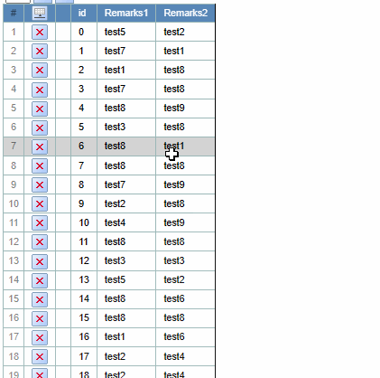
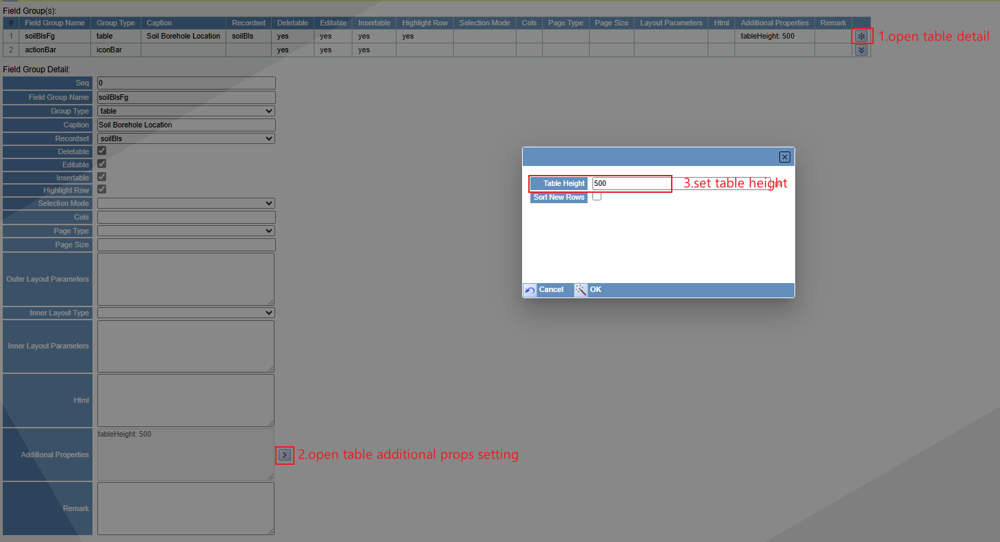

## Function

If the list body is taller than 400px, or if it exceeds the tableHeight set in
the page definition, clicking the button will put the list body into scroll
mode.

Clicking a different style button at the same location in scroll mode will
exit scroll mode.

Here is a example:

## User Setting

Set the table height of a table in page screenDefinition. If it is not set,
the lowest table height that can enter scroll mode is 400px by default.

## Implementation method

Get the height of the table settings.

    
    
    const tableScrollHeight = tableParams.additionalProps?.tableHeight ? parseInt(tableParams.additionalProps.tableHeight, 10) : null
    
    const [tableHeight, setTableHeight] = React.useState(tableScrollHeight) // Table max height
    const [scrollPrams, setScrollPrams] = useState({
      tableHeight: tableHeight,
      handleScroll: null,
    })
    

First create icons in the column header and the right side of the last row of
the table.

    
    
    const topIconNode = React.useMemo(
      () => 
      

        

          {state.showRange.length !== 0 && showTopIcon ? (
            {tableHeight ? (
              </img>
            ) : (
              </img>
            )}
            ) : null}
        

        ...
      

      , [state.showRange, showTopIcon]
    )
    

Create click fuction enter scrolling mode and exit scrolling mode.

    
    
    const enterScrollingMode = () => {
      let tbody = document.getElementById("tbody " + name) as HTMLElement
      const newTableHeight = tableScrollHeight ? tableScrollHeight : 400
      if (tbody) {
        const tbodyHeight = tbody.getBoundingClientRect().height;
        if (tbodyHeight < newTableHeight ) {
          return
        }
      }
      setTableHeight(newTableHeight)
    }
    const exitScrollingMode = () => {
      setTableHeight(null)
    }
    

Exits the scroll mode when the table height is lower than the set maximum
table height because of deleted rows and is in scroll mode.

    
    
    React.useEffect(() => {
      let tbody = document.getElementById("tbody " + name) as HTMLElement
      if (tbody && tableHeight) {
        const tbodyHeight = tbody.getBoundingClientRect().height;
        if (tbodyHeight < tableHeight ) {
          exitScrollingMode()
        }
      }
    }, [tableHeight, state.showRange, name])
    
    const handleScroll = React.useCallback(() => {
      setScrollTimes((prevScrollTimes) => prevScrollTimes + 1)
    }, [])
    React.useEffect(() => {
      setScrollPrams({
        tableHeight: tableHeight,
        handleScroll: handleScroll,
      })
    }, [tableHeight, handleScroll])
    

Enter scroll mode and set the entire table to scrollable, with the thead set
to be fixed at the top.

    
    
    const Table: Types.TableComponent = ({ children, columns, hideColumnIndicators, tableName, scrollPrams }) => {
      const columnCount = columns + (hideColumnIndicators ? 0 : 1)
      const columnNodes = range(columnCount).map((i) => <col key={i} />)
      return (
        

          <table id={"table " + tableName} className="Spreadsheet__table">
            <colgroup>{columnNodes}</colgroup>
            <thead
              id={"thead " + tableName}
              style={{
                position: "sticky",
                top: 0,
                backgroundColor: "black",
              }}
            >
              {[children[0], children[1]]}
            </thead>
            {/* children[0]: headerRow,  children[1]: filterRow */}
            <tbody id={"tbody " + tableName}>{children[2]}</tbody>
            {/* children[2]: normalRow */}
            <tfoot id={"tbody " + tableName}>{children[3]}</tfoot>
            {/* children[3]: footerRow */}
          </table>
        

      )
    }
    

