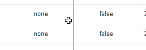
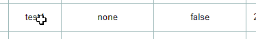
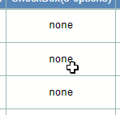
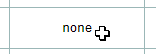
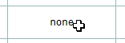
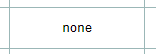
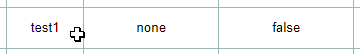
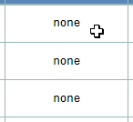
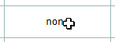

**mode** | **Shortcut Keys** | **Function** | **GIF**  
---|---|---|---  
View  | Arrow  | Move the selection box and it will stop when it reaches the boundary  |   
Tab  | Move the selection box to the right and it will jump to the first column of the next row when it reaches the boundary  |   
Shift + Tab  | Move the selection box to the left and it will jump to the last row of the previous column when it reaches the border  |   
Enter  | Move down the selection box and it will jump to the first row of the next column when it reaches the boundary  |   
Shift + Arrow  | Expand the selection range in four directions according to the arrows to select multiple cells  |   
Shift + Click  | Create a selection range between the active cell and the clicked cell to select multiple cells  |   
Delete  | Clear the currently selected cell  |   
F2  | Enter edit mode  |   
Esc  | Loss of focus  |   
Edit  | Tab  | Move the selection box to the right and enter view mode  |   
Shift + Tab  | Move the selection box to the left and enter view mode  |   
Enter  | Move down the selection box and enter view mode  |   
Shift + Click  | Create a selection range between the active cell and the clicked cell to select multiple cells, Enter view mode  |   
Esc  | Enter view mode  | 

