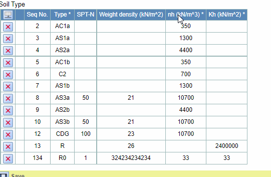
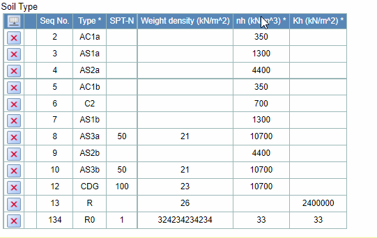
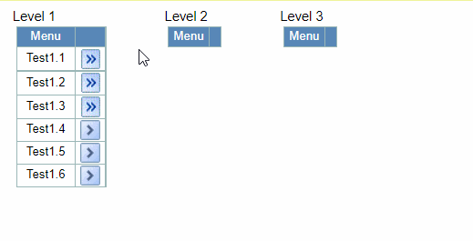

## Function

Double-click on the column header of a column to sort the entire table
according to the data in that column.

### Usage 1

1\. select a column

2\. double click the column title - sort this column ASC

3\. double click the same column title again - sort by DESC

Here is an example:

### Usage 2

1\. double click a column title - sort this column ASC

1\. double click the same column title again - sort by DESC

Here is an example:

## Implementation method

### Change in ColumnIndicator.tsx

Add a double-click event named "sortbyThisColumn" for the column header, and
display different icons in the column header depending on the state

    
    
    const ColumnIndicator: Types.ColumnIndicatorComponent = ({
      column,
      label,
      columnStatus,
      onSelect,
      onSorted,
    }) => {
      const handleClick = React.useCallback(
        (event: React.MouseEvent) => {
          onSelect(column, event.shiftKey)
        },
        [onSelect, column]
      )
      const handleDoubleClick = React.useCallback(
        (event: React.MouseEvent) => {
          onSorted(column, event.shiftKey)
        },
        [onSorted, column]
      )
      return (
        <th
          className="Spreadsheet__header Spreadsheet__header__column"
          onClick={handleClick}
          onDoubleClick={handleDoubleClick}
          tabIndex={0}
        >
          
            {label !== undefined ? label : columnIndexToLabel(String(column))}
            {columnStatus === 1 ? (
              
            ) : columnStatus === 2 ? (
              
            ) : columnStatus === 3 ? (
              
            ) : null}
          
        </th>
      )
    }
    
    export const enhance = (
      ColumnIndicatorComponent: Types.ColumnIndicatorComponent
    ): React.FC<
      Omit<Types.ColumnIndicatorProps, "selected" | "onSelect" | "onSorted">
    > => {
      return function ColumnIndicatorWrapper(props) {
        const dispatch = useDispatch()
        const selectEntireColumn = React.useCallback(
          (column: number, extend: boolean) =>
            dispatch(Actions.selectEntireColumn(column, extend)),
          [dispatch]
        )
        const sortbyThisColumn = React.useCallback(
          (column: number, extend: boolean) =>
            dispatch(Actions.sortbyThisColumn(column, extend)),
          [dispatch]
        )
        const selected = useSelector(
          (state) =>
            Selection.hasEntireColumn(state.selected, props.column) ||
            Selection.isEntireTable(state.selected)
        )
        return (
          <ColumnIndicatorComponent
            {...props}
            selected={selected}
            onSelect={selectEntireColumn}
            onSorted={sortbyThisColumn}
          />
        )
      }
    }
    

### Change in actions.ts and reducer.ts

Write the specific logic of the functions in actions.ts, and configure the
corresponding functions.

actions.ts:

    
    
    export const sortbyThisColumn = createAction<
      (
        column: number,
        extend: boolean
      ) => { payload: { column: number; extend: boolean } },
      "SORT_BY_THIS_COLUMN"
    >("SORT_BY_THIS_COLUMN", (column, extend) => ({
      payload: { column, extend },
    }));
    

To set the default sorting state when clicking, a slight modification is
needed in the original click function selectEntireColumn.

reducer.ts:

    
    
    builder.addCase(Actions.selectEntireColumn, (state, action) => {
      const { column, extend } = action.payload
      const { active } = state
    
      let newColumnStatus: number[] = Array(state.columnStatus.length).fill(0)
      if (state.columnStatus[column] === 0) {
        newColumnStatus[column] = 1
      } else {
        newColumnStatus[column] = state.columnStatus[column]
      }
    
      return {
        ...state,
        columnStatus: newColumnStatus,
        selected:
          extend && active
            ? Selection.createEntireColumns(active.column, column)
            : Selection.createEntireColumns(column, column),
        active: extend && active ? active : { ...Point.ORIGIN, column },
        mode: "view",
      }
    })
    builder.addCase(Actions.sortbyThisColumn, (state, action) => {
      const { column, extend } = action.payload
      const { active } = state
    
      let preData = state.data
      let preColumnStatus = state.columnStatus
      let newData: Matrix.Matrix<Types.CellBase> = []
      let newColumnStatus: number[] = Array(preColumnStatus.length).fill(0)
    
      preData.map((row: any) => {
        newData.push([...row])
      })
    
      const sortNewData = () => {
        newData.sort(function (a, b) {
          const c = a[column]?.value
          const d = b[column]?.value
          return c.localeCompare(d, "en", { numeric: true })
        })
      }
    
      if (preColumnStatus[column] === 1) {
        newColumnStatus[column] = 2
        sortNewData()
      } else if (preColumnStatus[column] === 2) {
        newColumnStatus[column] = 3
        sortNewData()
        newData.reverse()
      } else if (preColumnStatus[column] === 3) {
        newColumnStatus[column] = 2
        sortNewData()
      }
    
      let newHasModify: boolean[] = []
      newData.map((row) => {
        const id = row[0].value
        newHasModify.push(state.hasModify[id - 1])
      })
    
      return {
        ...state,
        data: newData,
        columnStatus: newColumnStatus,
        hasModify: newHasModify,
        selected:
          extend && active
            ? Selection.createEntireColumns(active.column, column)
            : Selection.createEntireColumns(column, column),
        active: extend && active ? active : { ...Point.ORIGIN, column },
        mode: "view",
      }
    })
    

### Change in TableFg.tsx

Add a new input to the ColumnIndicator component:

    
    
    ...
    <ColumnIndicator
      key={columnNumber}
      column={columnNumber}
      columnStatus={state.columnStatus[columnNumber]}  // XH 2022-07-04 column sort
      label={xxx}
    />
    ...
    

Make the size of the activation box vary with the appearance of the sort icon.

Add a new input to the Cell component:

    
    
    ...
    <Cell
      key={columnNumber}
      row={rowNumber}
      column={columnNumber}
      // @ts-ignore
      DataViewer={DataViewer}
      checkBoxCols={checkBoxCols} // LHH 2022-04-29
      columnStatus={state.columnStatus[columnNumber]}  // XH 2022-07-04 column sort
    />
    ...
    

### Change in Cell.tsx

Add a new item "columnStatus" to the trigger condition of the activation box
refresh function.

    
    
    React.useEffect(() => {
      const root = rootRef.current
      if (selected && root) {
        setCellDimensions(point, getOffsetRect(root))
      }
      if (root && active && mode === "view") {
        root.focus()
      }
    }, [setCellDimensions, selected, active, mode, point, data, columnStatus]) // XH, edit input size change
    

## Sorted with Plugin List

The original click event for the icon in the plugin column was to pass the row
number of the clicked row to the callback function. To ensure that the icon of
the plug-in column can change with the sorting event of the main table, the
passed parameter needs to be modified to the ID of the clicked column.

In the callback function, corresponding images are displayed based on the ID
of the column.

TableFg.tsx:

    
    
    {pluginList &&
      pluginList.map((plugin: any) => (
        <plugin.IconCell
          key={size.columns + pluginList.indexOf(plugin) + 1}
          id={state.data[rowNumber][0].value}
        />
      ))}
    

Here is an example:

