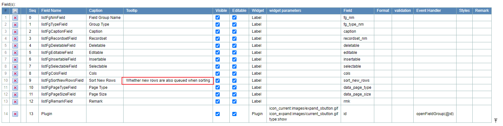
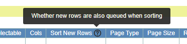

## Function

After setting tooltips for a field, a question mark icon will be displayed on
the front-end of the element corresponding to the filed, and the tips will be
displayed when the mouse is moved over the icon.

Setting：

Example：

## Implementation Method

    
    
    const [tooltip, setTooltip] = React.useState(String)
    
    React.useEffect(() => {
      if (String(value) === "false" || !value) {
        setChecked(false)
        setCheckBoxValue("false")
      } else {
        setChecked(true)
        setCheckBoxValue("true")
      }
      // set tooltip
      if (props.tip) {
        if (props.tip.includes("\\r\\n")) {
          setTooltip(props.tip.replace(/\\r\\n/g, "\r\n"))
        } else if (props.tip.includes("\\n")) {
          setTooltip(props.tip.replace(/\\n/g, "\r\n"))
        } else if (props.tip.includes("\\r")) {
          setTooltip(props.tip.replace(/\\r/g, "\r\n"))
        } else {
          setTooltip(props.tip)
        }
      }
    }, [props, value])
    
    ...
    
    return (
      <>
         ...
    
         {tooltip ? {tooltip} : null}
    
         ...
      </>
    )
    

